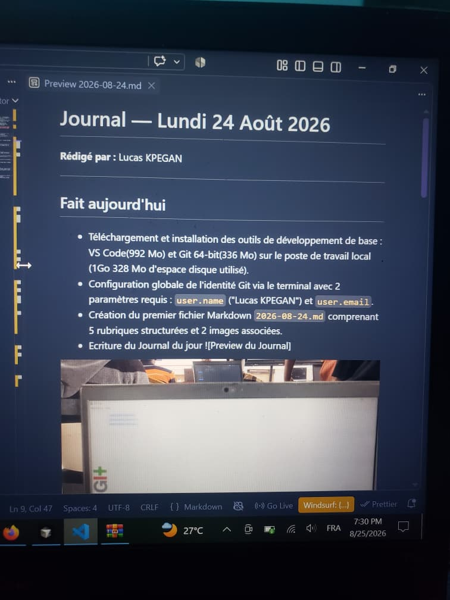
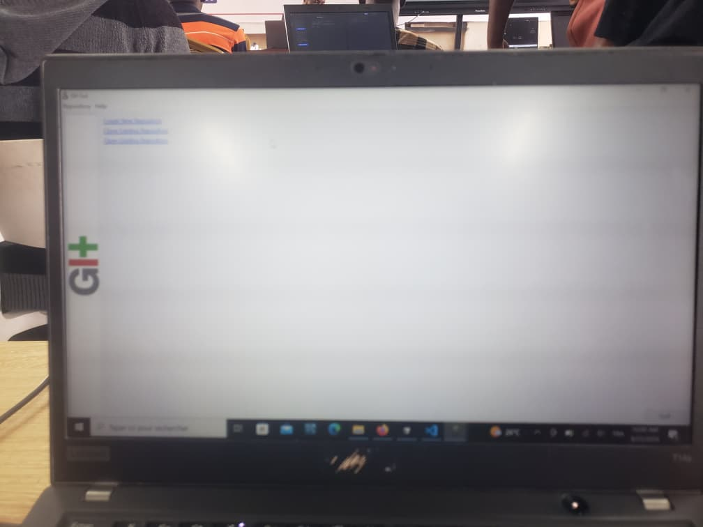
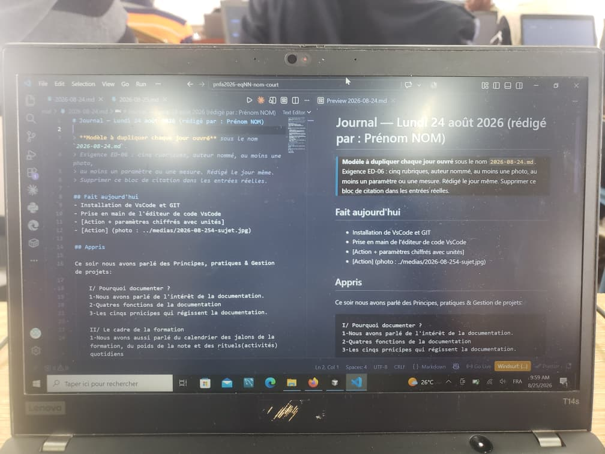

# Journal — Lundi 24 Août 2026 (rédigé par Lucas KPEGAN)

---

## Fait aujourd'hui

- Téléchargement et installation des outils de développement de base : VS Code(992 Mo) et Git 64-bit(336 Mo) sur le poste de travail local (1Go 328 Mo d'espace disque utilisé).
- Configuration globale de l'identité Git via le terminal avec 2 paramètres requis : `user.name` ("Lucas KPEGAN") et `user.email`.
- Création du premier fichier Markdown `2026-08-24.md` comprenant 5 rubriques structurées et 2 images associées.
- Ecriture du Journal du jour 




---

## Appris

- **Gestion de projet** : intégration des 4 fonctions de la documentation (mémoire, transmission, réplicabilité, évaluation) et des 5 principes directeurs de la formation.
- **Architecture de travail** : visualisation du flux de données à travers 3 espaces distincts :

  ```
  Éditeur VS Code local  →  Dépôt local Git  →  Serveur distant GitHub
  ```

- **Formatage Markdown** : syntaxe des balises de titres (`#` à `###`), des listes à puces, et intégration d'images avec le schéma de chemin relatif `../medias/`.

---

## Raté, puis corrigé

**Erreur :** Non-affichage des images lors de la prévisualisation Markdown dans VS Code (2 images affichaient une icône de lien brisé).

**Hypothèse :** Erreur de chemin relatif — présence d'un espace en trop avant la parenthèse fermante et mauvaise casse de l'extension (`.jpeg` vs `.JPEG`).

**Correction :** Suppression de l'espace parasite et alignement exact du nom du fichier.

**Résultat :** Affichage fonctionnel des visuels dans l'éditeur.

---

## Décidé

Application stricte de la règle de nommage `YYYY-MM-DD-nom-image.jpg` pour tous les visuels importés dans le dossier `../medias/`, afin d'éviter toute rupture de lien.

---

## À faire demain

- [ ] Réception de l'invitation organisationnelle et création du dépôt GitHub `pnfa2026-KPEGAN-LUC` — *Lucas*
- [ ] Exécution du 1er commit local et liaison avec le dépôt distant — *Lucas*