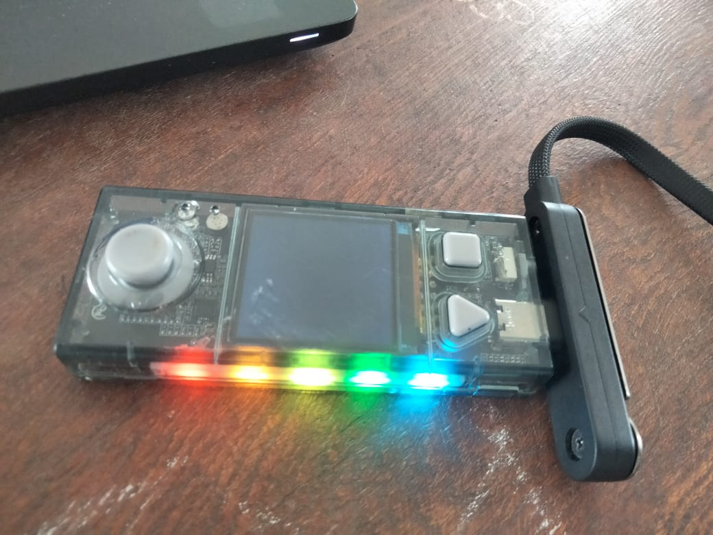

# Journal — Jeudi 27 Août 2026 (rédigé par Lucas KPEGAN)

---

## Fait aujourd'hui

### Électronique & Microcontrôleurs : CyberPi & Écosystème mBuild

* **Présentation du CyberPi :** Étude d'ensemble du mini-ordinateur pédagogique (écran couleur 1.44'', joystick 5 directions, boutons A/B/Home, capteur de lumière, microphone, accéléromètre/gyroscope 3 axes, bande LED RGB et batterie Li-ion 3.7 V).
* **Chaîne d'acquisition et d'action :** Modélisation de la logique fondamentale d'un objet intelligent : Capteur (mesure la grandeur physique) → Programme (décide) → Actionneur (agit sur l'environnement).
* **Exploration des modules mBuild (« Plug and Play ») :**
  * *Capteurs :* Présentation et prise en main du capteur d'humidité du sol, capteur à ultrasons, capteur de luminosité, capteur PIR (présence/mouvement), capteur tactile/bouton, et émetteur/récepteur infrarouge (IR Transceiver TX/RX).
  * *Actionneurs :* Utilisation des anneaux/rubans LED RGB, servomoteurs 9 g (0-180°), moteur-réducteurs CC et buzzers.
* **Environnement logiciel :** Installation et configuration de **mBlock** pour la programmation visuelle (en blocs) et en Python du CyberPi et des modules mBuild.

### Projet Pratique 1 — Veilleuse Automatique

* **Matériel utilisé :** CyberPi + capteur de luminosité + anneau LED RGB.
* **Logique algorithmique :** Lecture en boucle continue du niveau de luminosité ambiante. Si la valeur mesurée passe sous un seuil prédéfini (obscurité), allumage automatique de l'anneau LED avec une couleur chaude ; sinon, extinction de la LED.
* **Concepts d'apprentissage clés :** Implémentation d'une boucle infinie, condition si/sinon, et étalonnage/réglage d'un seuil numérique.

---

### Impression 3D (FDM/FFF) : Du Slicing au G-code & Paramétrage

* **Environnement logiciel :** Installation de **Bambu Studio** (pour le pilotage direct et le suivi de l'imprimante Bambu Lab P2S) et de **PrusaSlicer** (pour le tranchage multi-machines et la préparation avancée des fichiers 3D).
* **Le rôle du Slicer :** Étude du processus de conversion d'un modèle 3D en instructions machines G-code (découpe virtuelle en couches horizontales, consignes de vitesse, de température et d'extrusion). Tour d'horizon des slicers principaux (Bambu Studio, OrcaSlicer, PrusaSlicer, Cura, SuperSlicer, ideaMaker).
* **Maîtrise des paramètres clés de tranchage :**
  * *Hauteur de couche et largeur de ligne :* Impact sur la finition de surface et le temps d'impression (compromis entre résolution fine et vitesse).
  * *Températures :* Ajustement de la température de buse (fluidification du filament) et du plateau (adhérence de la première couche, prévention du *warping*).
  * *Vitesse, débit (flow) & rétraction :* Calibrage du flux d'extrusion et contrôle de la rétraction pour éviter les fils d'ange (*stringing*).
  * *Parois (Walls) & Couches inf/sup (Top/Bottom) :* Configuration du nombre de parois pour la résistance mécanique et des couches pleines de fermeture.
  * *Motifs et taux de remplissage (Infill) :* Prise en main des motifs courants (Grid, Lines, Gyroid, Honeycomb, Cubic) pour optimiser le rapport poids/résistance.

### Projet Pratique 2 — Impression 3D d'un cube de test

* **Logiciel & Préparation :** Tranchage d'un cube de test (`Cube016Profile`) sur Bambu Studio avec du filament PETG (buse 0.4 mm, hauteur de couche 0.24 mm, plateau texturé).
* **Lancement & Supervision :** Envoi du G-code à l'imprimante Bambu Lab P2S et suivi en direct de l'impression via l'interface de contrôle et la caméra embarquée.

---

### CAO & Modélisation 3D

* **Tentative d'installation d'Autodesk Fusion :** Essai d'installation du logiciel de modélisation CAO 3D (interrompu en raison d'une instabilité de la connexion internet locale).

---

### Découpe & Gravure Laser

* **Initiation à la technologie Laser :** Découverte des principes de la découpe et de la gravure vectorielle/raster, réglages des paramètres de vitesse, puissance et focale.

### Projet Pratique 3 — Fabrication d'une Carte de Visite

* **Conception & Réalisation :** Fabrication pratique d'une carte de visite personnalisée par gravure et découpe laser.

---

## Appris

* **Principe de fonctionnement d'un objet connecté (IoT/IA) :** Assimilation du rôle de chaque composant dans la chaîne de traitement de l'information (mesure, décision algorithmique, action physique).
* **Modularité mBuild :** Compréhension du chaînage des modules « plug and play » sur le microcontrôleur CyberPi sans nécessiter de câblage complexe sur breadboard.
* **Programmation sous conditions :** Structuration d'une boucle d'acquisition temps réel avec gestion de seuil pour automatiser le comportement d'un actionneur (anneau LED).
* **Chaîne de fabrication FDM :** Compréhension globale du flux Modèle 3D → Slicer → G-code → Imprimante.
* **Optimisation des paramètres d'impression :** Capacité à adapter l'infill, les parois et la rétraction pour prévenir les défauts structurels (trous, affaissement, *stringing*, *warping*).
* **Environnement logiciel du FabLab :** Prise en main du workflow logiciel complet, depuis le logiciel de programmation (**mBlock**) jusqu'aux outils de tranchage 3D (**Bambu Studio**, **PrusaSlicer**).

---

## Raté, puis corrigé

**Problème réseau (Autodesk Fusion) :** échec du téléchargement et de l'installation d'Autodesk Fusion lié à l'instabilité de la connexion internet.

*Correction / Solution prévue :* relancer le téléchargement et la configuration du compte dès que le débit réseau sera stabilisé.

**Problème d'allumage et de connexion du CyberPi (Électronique) :** après avoir branché le câble au CyberPi, impossible de lancer le processus ni de faire démarrer le composant correctement.

*Correction :* intervention de l'enseignant pour vérifier la chaîne d'alimentation/connexion et guider le démarrage initial.

**Perte de fil pendant le cours de Modélisation 3D :** difficultés à suivre l'enchaînement des étapes logicielles et des configurations dans le Slicer.

*Correction :* entraide et soutien continu des collègues de formation pour se réaligner rapidement sur le fil des manipulations.

**Vocabulaire technique complexe (Modélisation & Découpe Laser) :** utilisation d'un jargon technique très dense par l'intervenant durant les explications théoriques.

*Correction :* interruptions constructives durant le cours pour faire clarifier les termes complexes, et sollicitation permanente des amis et du moniteur pour valider la configuration exacte des valeurs de découpe/gravure laser.

---

## Décidé

* **Structuration des prototypes IoT :** Utilisation systématique du CyberPi et des modules mBuild pour le prototypage rapide d'objets interactifs avant toute intégration électronique personnalisée.

---

## À faire demain

* **Prolongement du projet Veilleuse :** Programmer une variation progressive de la couleur ou de l'intensité lumineuse selon le niveau exact de luminosité mesuré.
* **Prototypage de nouveaux projets :** Exploiter d'autres capteurs mBuild (ultrasons, humidité du sol) pour concevoir un second cas d'usage pratique.
* **Analyse de la pièce imprimée :** Contrôle dimensionnel au pied à coulisse du cube de test et évaluation de la qualité des états de surface et de l'adhérence des couches.