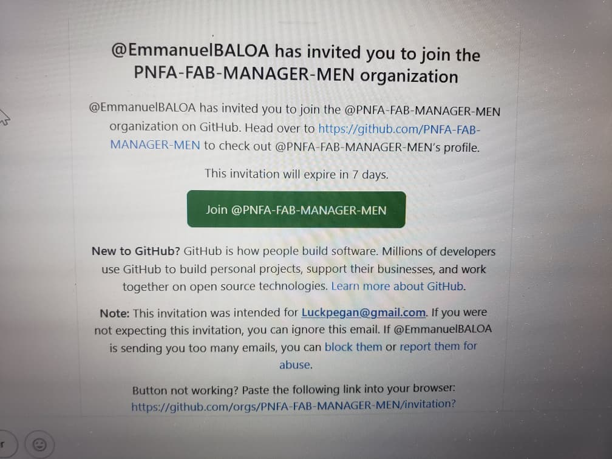
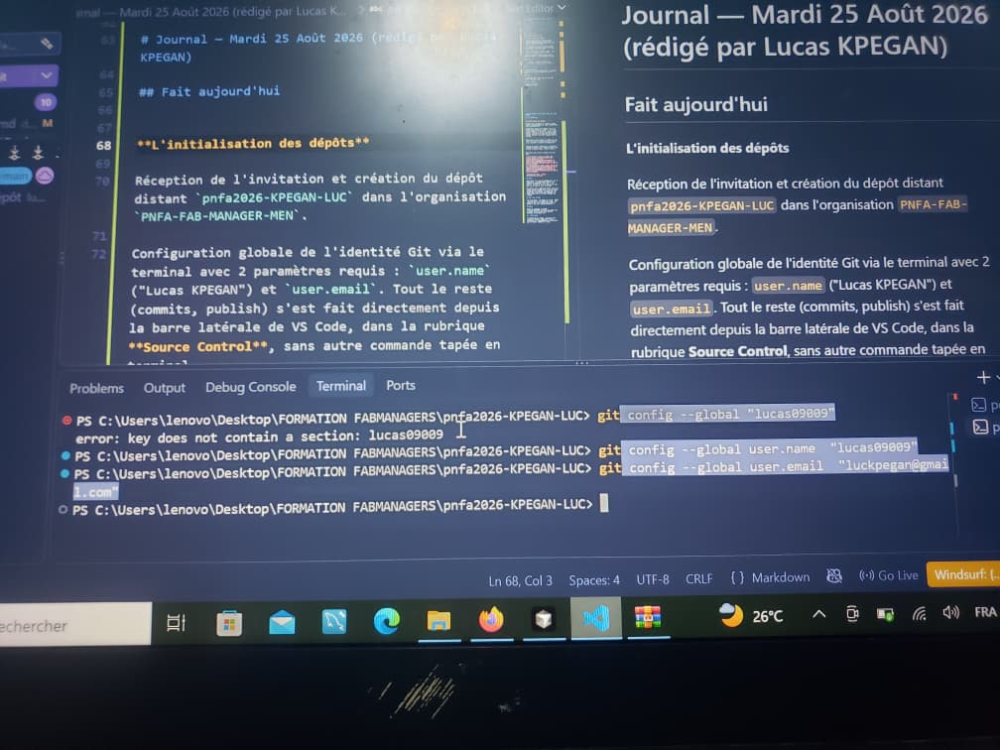

# Journal — Mardi 25 Août 2026 (rédigé par Lucas KPEGAN)

## Fait aujourd'hui

**L'initialisation des dépôts**

Réception de l'invitation et création du dépôt distant `pnfa2026-KPEGAN-LUC` dans l'organisation `PNFA-FAB-MANAGER-MEN`.

Configuration globale de l'identité Git via le terminal avec 2 paramètres requis : `user.name` ("Lucas KPEGAN") et `user.email`.  Tout le reste (commits, publish) s'est fait directement depuis la barre latérale de VS Code, dans la rubrique **Source Control**, sans autre commande tapée en terminal.

Création du journal `2026-08-25.md` comprenant 5 rubriques structurées et 2 images associées, puis création du premier commit (`Initial commit`).

Nous avons ainsi réalisé [2 commits](https://github.com/PNFA-FAB-MANAGER-MEN/pnfa2026-KPEGAN-LUC/commits/main/) ce 25 août 2026 :

- `docs(journal): Entrée du 25 août 2026`
- `Initialisation du dépôt`

Association du dépôt distant via HTTPS avec `git remote add origin` et premier push de la branche `main` contenant 3 fichiers de configuration.

## Appris

Utilisation de la ligne de commande pour lier un dépôt local à un dépôt distant GitHub, et de l'interface VS Code pour tout le reste du suivi de version.

Distinction entre l'espace de travail local et le serveur distant (GitHub) dans le flux de travail collaboratif d'un FabLab : le dépôt local sert à valider des versions même hors connexion, le dépôt distant sert de référence partagée pour l'équipe.

## Raté, puis corrigé

Lors de ce cours, j'ai hésité sur le nom à donner à mon repository. J'ai demandé de l'aide à mes collègues, qui m'ont assisté pour trouver et valider le bon nom (`pnfa2026-KPEGAN-LUC`).

## Décidé

Garder la convention de nommage `pnfa2026-NOM-PRENOM` pour tous les dépôts liés au projet, afin d'éviter toute nouvelle hésitation la prochaine fois.

## À faire demain

- Configuration du fichier `.gitignore` pour exclure les fichiers temporaires — Lucas
- Rédaction de la documentation de présentation dans le fichier `README.md` — Lucas