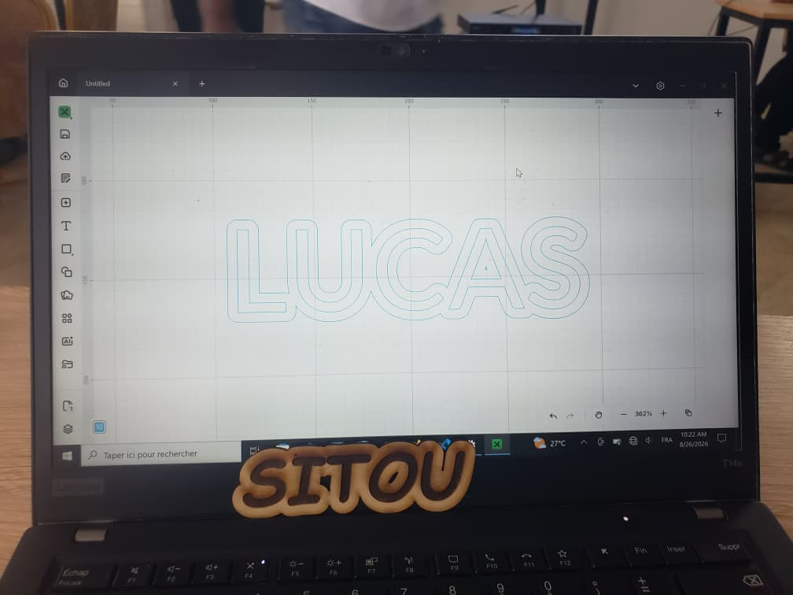
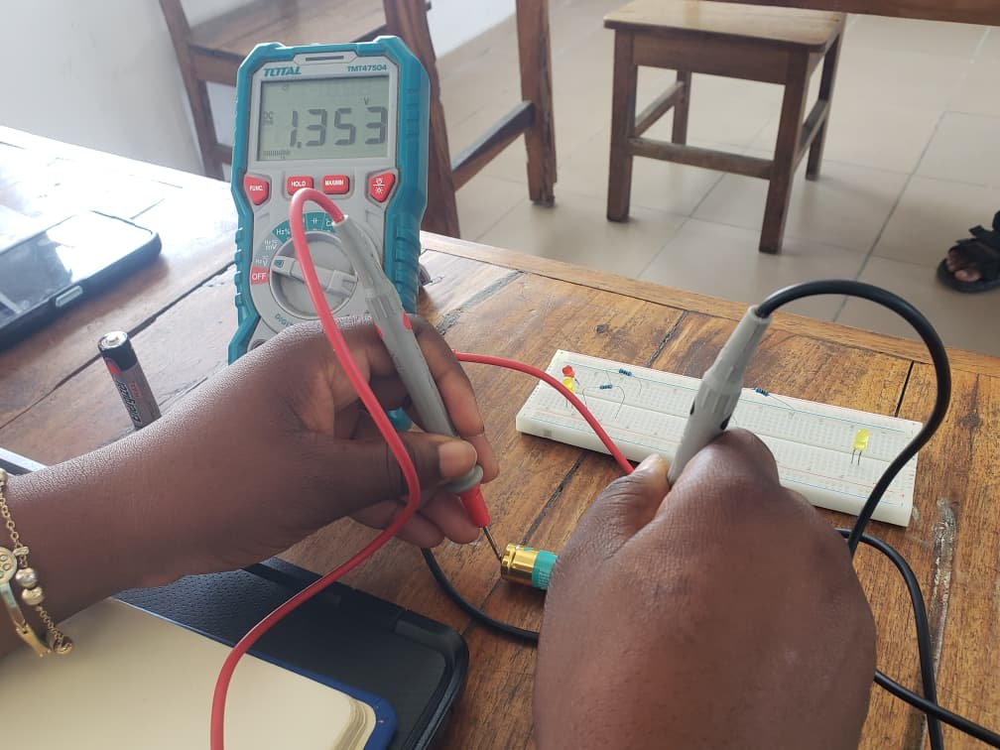

# Journal — Mercredi 26 Août 2026 (rédigé par Lucas KPEGAN)
---
## Fait aujourd'hui

### Découpe Laser

* **Technologie principale :** Utilise un faisceau laser concentré de haute puissance pour couper, graver ou sculpter des matériaux (bois, acrylique, cuir, carton) avec une haute précision.
* **Paramètres clés :** La puissance (watts), la vitesse de déplacement, la distance mef de point (focale) et l'épaisseur du matériau déterminent la profondeur de coupe par rapport à la gravure de surface.
* **Sécurité et opérations :** Nécessite un système d'évacuation actif pour les fumées toxiques, des lunettes de protection adaptées et le respect strict d'éviter les matériaux dangereux (comme le PVC en raison du dégagement de gaz chloré).

---

### Bases de l'Électronique en FabLab

* **Composants essentiels :** Microcontrôleurs (Arduino, ESP32), composants passifs (résistances, condensateurs), semi-conducteurs (diodes, transistors), ainsi que capteurs et actionneurs. 
* **Outils de prototypage :** Plaques d'essai sans soudure (breadboards) pour une exécution rapide, multimètres numériques (mesure de tension, courant, résistance) et alimentations stabilisées de laboratoire.
<!-- * **Conception et fabrication de circuits :** Dessin de schémas de base, assemblage de composants par soudure manuelle et fraisage de circuits imprimés (PCB) personnalisés simple/double face à l'aide de mini-fraiseuses CNC. -->

---

### Fabrication Additive (Impression 3D)

* **FDM (Dépôt de fil fondu) :** Fond un filament thermoplastique (PLA, PETG, ABS) extrudé à travers une buse chauffée couche par couche ; idéal pour les prototypes structurels.
* **SLA/MSLA (Stéréolithographie) :** Utilise la lumière UV pour solidifier une résine liquide ; produit des détails très précis et des surfaces lisses. .jpeg)
.jpeg)
.jpeg)

---

### Présentation et Discussion de Projet Personnel

* **Validation de l'idée :** Analyse de la disponibilité des composants, de la faisabilité du projet et des contraintes de temps selon les ressources du FabLab.
* **Intégration interdisciplinaire :** Combinaison de boîtiers imprimés en 3D ou découpés au laser avec des circuits électroniques sur mesure et des microcontrôleurs.
* **Prototypage itératif :** Définition du prototype minimum viable (MVP) avant d'entamer la fabrication finale du produit.

## Appris

Optimisation des paramètres laser : Réglage fin de la vitesse et de la puissance selon le matériau pour éviter les brûlures sur le bois tout en conservant une coupe nette.

Prototypage résine (SLA) : Importance de l'orientation de la pièce dans le logiciel de tranchage pour minimiser l'impact des supports sur les surfaces visibles.

Notions fondamentales en électronique : Définitions théoriques et relations pratiques entre la tension (V), l'intensité (I) et la résistance (R).

Lecture des résistances : Décodage des anneaux de couleur pour calculer manuellement la valeur ohmique exacte et sa tolérance.

Mesures pratiques au multimètre : Manipulations directes du multimètre pour mesurer physiquement la tension, l'intensité et la résistance sur circuit.

Optimisation découpe laser & 3D : Réglages puissance/vitesse sur laser pour le bois, et paramétrage des supports SLA selon l'orientation des pièces.

## Raté, puis corrigé

Erreur d'ajustement du fichier de découpe laser : Risque de mauvais calibrage lors du positionnement initial de la pièce par le moniteur.

    Correction : Utilisation de la fonction d'ajustement automatique de la machine de découpe laser demandée à temps pour réaligner parfaitement le modèle avant de lancer la coupe.

Prise en main des mesures au multimètre : Hésitation et blocage au moment de mesurer les grandeurs électriques sur le circuit physique.

    Correction : Passage de main pour obtenir de l'aide et observation de la bonne méthode de branchement (sélection du mode, placement des pointes de touche) pour réussir les mesures.

## Décidé

Application stricte de la règle de nommage `YYYY-MM-DD-nom-image.jpg` pour tous les visuels importés dans le dossier `../medias/`, afin d'éviter toute rupture de lien.

## À faire demain
Exploration des modules mBuild (« Plug and Play ») 
Début des TPs dans les divers ateliers

