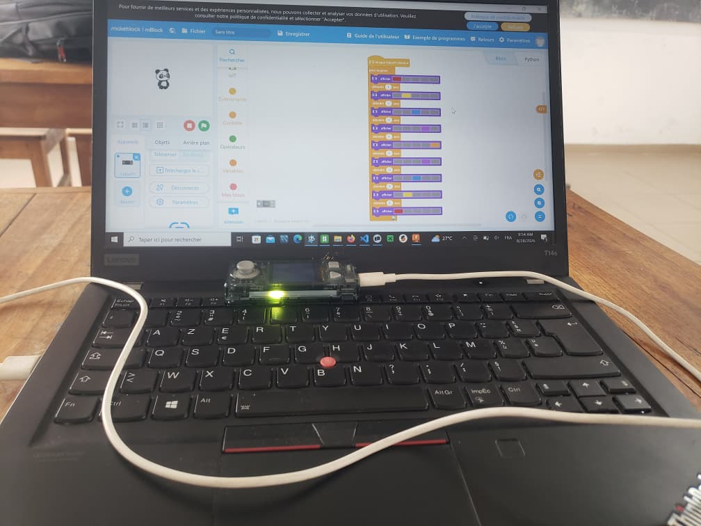
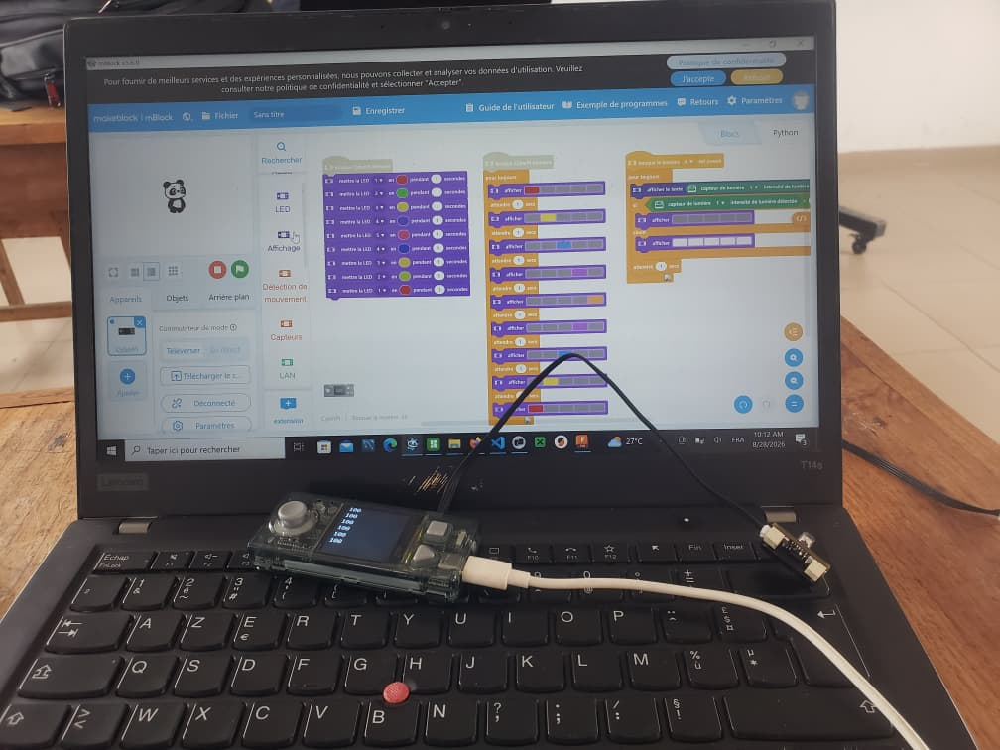
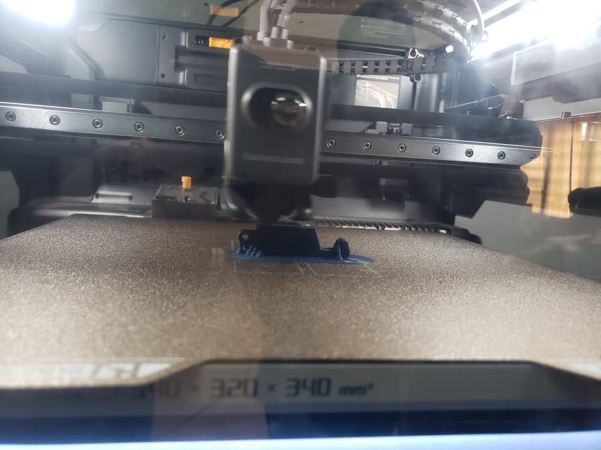
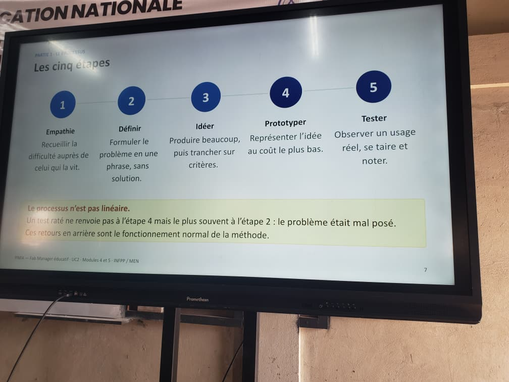

# Journal — Vendredi 28 Août 2026 (rédigé par Lucas KPEGAN)

---

## Fait aujourd'hui

### Électronique & Microcontrôleurs (CyberPi & mBuild)
* **Animation lumineuse CyberPi :** Programmation d'un chenillard ("jeu de lumière") avec décalage progressif des LED sur une boucle indéfinie.

* **Asservissement à la lumière ambiante :** Script mBlock intégrant une condition `si / sinon` reliée au capteur de luminosité mBuild (déclenchement du programme à l'appui sur le bouton A). Affichage dynamique des valeurs mesurées sur l'écran du CyberPi et contrôle des LED selon le niveau d'éclairement.

### Découpe Laser & Logiciel xTool
* **Familiarisation avec xTool Creative Space :** Exploration de l'interface, gestion du positionnement des éléments et organisation des calques (gravure vs découpe).
* **Personnalisation de carte de visite :** Importation du QR code généré, ajout de la mention textuelle "Professeur de Mathématiques" et calage précis de la mise en page.

* **Gravure et découpe sur bois :** Réglage des paramètres (puissance et vitesse) sur contreplaqué, ajout des étoiles de repère aux quatre coins et de la mention de copyright avant l'exécution du travail laser.

### Impression 3D FDM (Bambu Lab Série P/H)
* **Système AMS 2 :** Découverte du module d'alimentation multi-matériaux/multi-couleurs et procédure de chargement automatique du filament PLA.
* **Workflow & Suivi d'impression :** Transmission des fichiers tranchés (slicing) via clé USB et gestion des erreurs.
.jpeg)
* **Cas pratique en direct :** Impression de la pièce technique `lucas.gcode` avec suivi en temps réel des températures (buse à 220°C, plateau à 55°C, enceinte à 31°C).

### Design Thinking & Méthode en Spirale
* **Processus en 5 étapes :** Application des phases Empathie, Définir, Idéer, Prototyper et Tester.

* **Gestion de projet itérative :** Modélisation de la boucle en 4 temps (Fixer l'objectif, Nommer le risque, Réaliser et vérifier, Décider de la suite) et structuration d'une version V0 minimale.
* **Planification :** Découpage du calendrier projet (V0 à V3) jusqu'au gel des livrables (17 septembre à 18h) et aux soutenances (18 septembre).

---

## Appris

* **Formulation rigoureuse du problème** : rédaction d'un énoncé selon la structure *« [Usager] a besoin de [besoin] parce que [constat de l'entretien] »* sans inclure prématurément de solution technique (capteur, boîtier ou écran).
* **Méthode en spirale vs cascade** : privilégier le développement itératif par versions fonctionnelles complètes (V0, V1, V2, V3) pour identifier et lever les risques bloquants dès les premières boucles, plutôt qu'un modèle en cascade vulnérable lors de l'intégration finale.
* **Grille de test utilisateur** : suivi de l'expérimentation à l'aide d'un tableau à 3 colonnes (*ce que l'usager tente*, *ce qui le bloque*, *ce qu'il contourne*), l'analyse des contournements révélant directement les fonctionnalités manquantes.
* **Prototypage V0** : nécessité de concevoir une version minimale traversant l'intégralité du flux fonctionnel (ex. carte XIAO ESP32S3 lisant un capteur et affichant sur moniteur série) avant toute fabrication physique ou impression de boîtier.
* **Transposition pédagogique** : structuration des séances de création avec les élèves en séquences minutées au tableau et soumises à des contraintes matérielles/budgétaires claires pour canaliser l'idéation.

---

## Raté, puis corrigé

* **Problème 1 (Électronique) :** Résultat non conforme sur l'affichage et le contrôle des LED.
  * *Hypothèse :* Mauvaise organisation de la structure des blocs de code dans mBlock (mauvais emboîtement des conditions `si / sinon` dans la boucle).
  * *Correction :* Reconfiguration de la logique du script et réagencement propre des blocs de condition.
  * *Résultat :* Affichage correct des valeurs de luminosité à l'écran et déclenchement précis du chenillard/LED selon le seuil.

* **Problème 2 (Impression 3D) :** Fichier d'impression non adapté sur la machine lors du lancement via la clé USB.
  * *Hypothèse :* Erreur de sélection du profil d'imprimante dans le logiciel de tranchage (slicer) avant l'exportation du fichier G-code/3MF.
  * *Correction :* Sélection explicite de la bonne imprimante Bambu Lab cible dans l'interface du logiciel, nouveau tranchage du modèle et réexportation sur la clé USB.
  * *Résultat :* Compatibilité parfaite du fichier et lancement sans erreur du cycle d'impression.

---

## Décidé

* Appliquer une double vérification systématique dans le slicer (profil d'imprimante + type de filament) avant tout transfert sur clé USB.
* Structurer la logique algorithmique sur papier ou en pseudo-code avant de passer à l'assemblage des blocs dans mBlock.
* Appliquer la règle d'évaluation de la V0 : s'assurer qu'elle réalise l'ensemble de la chaîne fonctionnelle (entrée $\rightarrow$ traitement $\rightarrow$ sortie) sans sauter d'étape.

---

## À faire demain

* [ ] Structurer la grille d'entretien et mener la phase d'empathie auprès d'un usager ciblé — *Lucas*
* [ ] Formaliser l'énoncé du problème en une phrase sans mention d'objet technique — *Lucas*
* [ ] Monter la V0 sur platine d'essai (XIAO ESP32S3 + capteur) pour valider le premier jalon du calendrier — *Lucas*

<!-- # Journal — Vendredi 28 Août 2026 (rédigé par Lucas KPEGAN)

---

## Fait aujourd'hui

### Électronique & Microcontrôleurs (CyberPi & mBuild)

* **Animation lumineux CyberPi :** Programmation d'un chenillard ("jeu de lumière") avec décalage progressif des LED sur une boucle indéfinie.
* **Asservissement à la lumière ambiante :** Script mBlock intégrant une condition `si / sinon` reliée au capteur de luminosité mBuild. Affichage dynamique des valeurs mesurées sur l'écran du CyberPi et déclenchement automatique des LED selon le niveau d'éclairement. Le code commence lorsqu'on presse le bouton A

### Découpe Laser & Logiciel xTool

* **Familirisation avec xTool Creative Space :** Exploration de l'interface, gestion du positionnement des éléments et organisation des calques (gravure vs découpe).
* **Personnalisation de carte de visite :** Importation du QR code généré, ajout de la mention textuelle "Professeur de Mathématiques" et calage précis de la mise en page.
* **Gravure et découpe sur bois :** Réglage des paramètres (puissance et vitesse) sur contreplaqué, ajout des étoiles de repère aux quatre coins et de la mention de copyright avant l'exécution du travail laser.

### Impression 3D FDM (Bambu Lab Série P/H)

* **Système AMS 2 :** Découverte du module d'alimentation multi-matériaux/multi-couleurs et procédure de chargement automatique du filament PLA.
* **Workflow & Suivi d'impression :** Transmission des fichiers tranchés (slicing) via clé USB ou réseau, et gestion des erreurs.
* **Cas pratique en direct :** Impression de la pièce technique `lucas.gcode` (suivi des paramètres de buse, plateau et enceinte en temps réel) pour garder un style technique.

### Design Thinking & Méthode en Spirale

* **Processus en 5 étapes :** Application des phases Empathie, Définir, Idéer, Prototyper et Tester.
* **Gestion de projet itérative :** Modélisation de la boucle en 4 temps (Fixer l'objectif, Nommer le risque, Réaliser et vérifier, Décider de la suite) et structuration d'une version V0 minimale.
* **Planification :** Découpage du calendrier projet (V0 à V3) jusqu'au gel des livrables (17 septembre à 18h) et aux soutenances (18 septembre).

---

## Appris

* **Formulation rigoureuse du problème** : rédaction d'un énoncé selon la structure *« [Usager] a besoin de [besoin] parce que [constat de l'entretien] »* sans inclure prématurément de solution technique (capteur, boîtier ou écran).
* **Méthode en spirale vs cascade** : privilégier le développement itératif par versions fonctionnelles complètes (V0, V1, V2, V3) pour identifier et lever les risques bloquants dès les premières boucles, plutôt qu'un modèle en cascade vulnérable lors de l'intégration finale.
* **Grille de test utilisateur** : suivi de l'expérimentation à l'aide d'un tableau à 3 colonnes (*ce que l'usager tente*, *ce qui le bloque*, *ce qu'il contourne*), l'analyse des contournements révélant directement les fonctionnalités manquantes.
* **Prototypage V0** : nécessité de concevoir une version minimale traversant l'intégralité du flux fonctionnel (ex. carte XIAO ESP32S3 lisant un capteur et affichant sur moniteur série) avant toute fabrication physique ou impression de boîtier.
* **Transposition pédagogique** : structuration des séances de création avec les élèves en séquences minutées au tableau et soumises à des contraintes matérielles/budgétaires claires pour canaliser l'idéation.

---

## Raté, puis corrigé

Problème 1 (Électronique) : Résultat non conforme sur l'affichage et le contrôle des LED.

    Hypothèse : Mauvaise organisation de la structure des blocs de code dans mBlock (mauvais emboîtement des conditions si / sinon dans la boucle).

    Correction : Reconfiguration de la logique du script et réagencement propre des blocs de condition.

    Résultat : Affichage correct des valeurs de luminosité à l'écran et déclenchement précis du chenillard/LED selon le seuil.

Problème 2 (Impression 3D) : Fichier d'impression non adapté sur la machine lors du lancement via la clé USB.

    Hypothèse : Erreur de sélection du profil d'imprimante dans le logiciel de tranchage (slicer) avant l'exportation du fichier G-code/3MF.

    Correction : Sélection explicite de la bonne imprimante Bambu Lab cible dans l'interface du logiciel, nouveau tranchage du modèle et réexportation sur la clé USB.

    Résultat : Compatibilité parfaite du fichier et lancement sans erreur du cycle d'impression.
---

## Décidé

Appliquer une double vérification systématique dans le slicer (profil d'imprimante + type de filament) avant tout transfert sur clé USB.

Structurer la logique algorithmique sur papier ou en pseudo-code avant de passer à l'assemblage des blocs dans mBlock.

Appliquer la règle d'évaluation de la V0 : s'assurer qu'elle réalise l'ensemble de la chaîne fonctionnelle (entrée $\rightarrow$ traitement $\rightarrow$ sortie) sans sauter d'étape
---

## À faire demain

* [ ] Structurer la grille d'entretien et mener la phase d'empathie auprès d'un usager ciblé — *Lucas*
* [ ] Formaliser l'énoncé du problème en une phrase sans mention d'objet technique — *Lucas* -->

