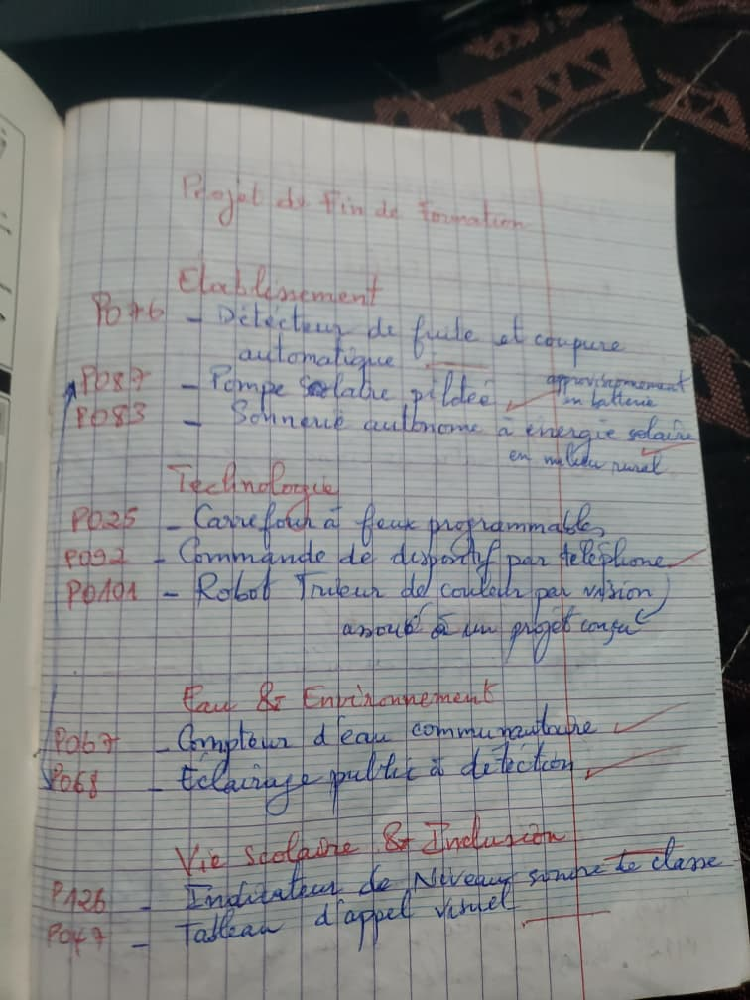
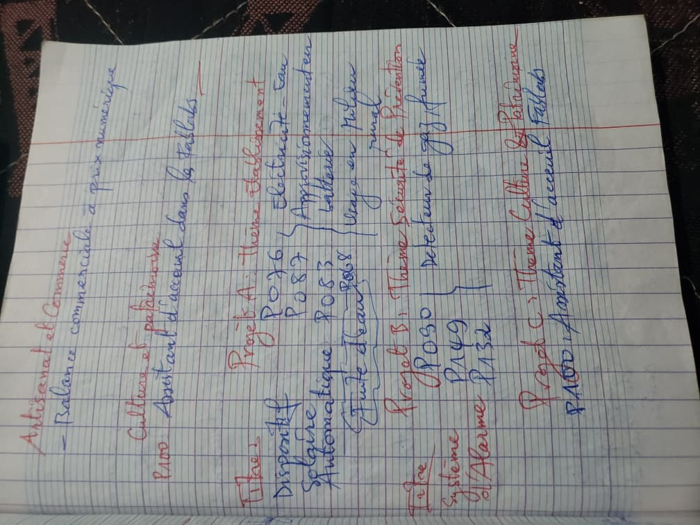
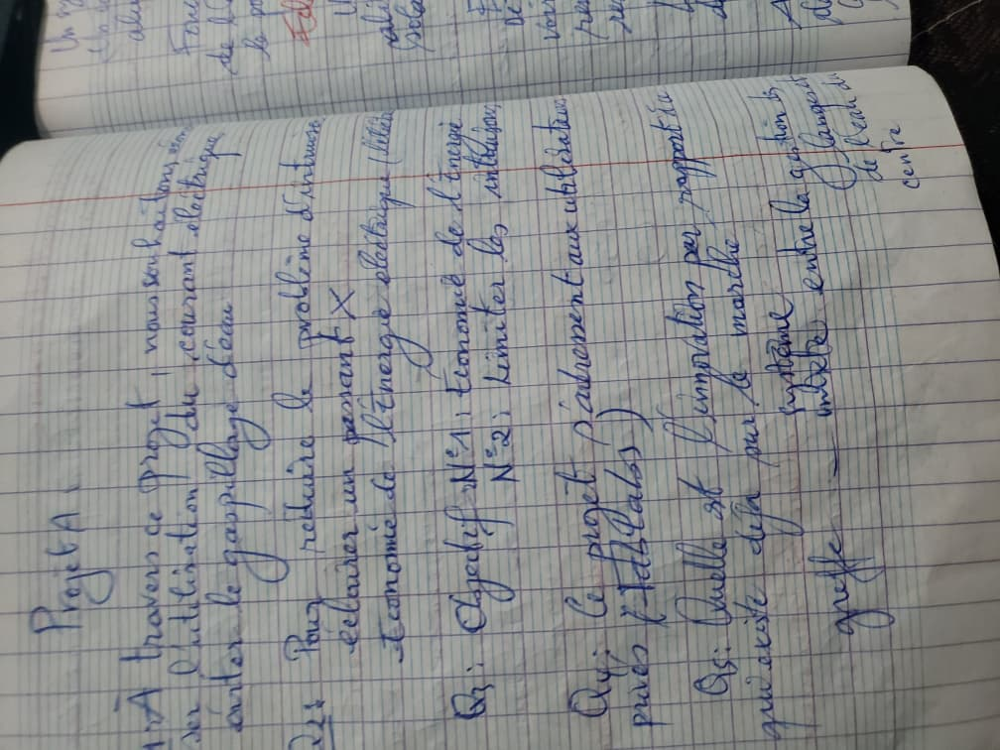

# Journal — Samedi 29 Août 2026 (rédigé par Lucas KPEGAN)

---

## Fait aujourd'hui

### Sélection du Projet de Fin de Formation (Soutenance)

* **Exploration thématique des sujets :** Analyse d'un catalogue de projets classés par domaines d'application :
* *Établissement / Équipements :* Détecteur de fuite et coupure automatique (P076), Pompe solaire pilotée / approvisionnement eau (P087), Sonnerie autonome à énergie solaire en milieu rural (P083), Armoire à outils à badge (P077) et Sonde de qualité de l'air (P081).
* *Technologie & Pédagogie :* Carrefour à feux programmables (P025), Commande de dispositif par téléphone (P092), Robot trieur de couleurs par vision (P0101) et Thermomètre de classe à grand affichage (P121).
* *Eau & Environnement :* Compteur d'eau communautaire (P067) et Éclairage public à détéction (P068).
* *Sécurité & Santé :* Rappel de prise de médicament, Balise clignotante de sécurité (P132), Détecteur de gaz/fumée (P090) et Boîtier d'alerte incendie.

* **Présélection des options (Shortlist) :**
* **Projet A (Thème Électricité / Eau / Approvisionnement) :** Combinaison des sujets P076, P087, P083 et P068. 
* **Projet B (Thème Sécurité & Prévention) :** Regroupement du détecteur de gaz/fumée (P090) et de la balise de sécurité (P132).
* **Projet C (Thème Culture & Patrimoine) :** Assistant d'accueil FabLab (P100).

* **Étude détaillée du sujet retenu (Projet A) :**
* **Titre retenu :** *Système d'éclairage et de pompage d'eau automatique (Système hybride)*.
* **Volet Pompage d'eau :** Détection automatique de la baisse de niveau d'eau dans le réservoir/citernes, déclenchement du pompage et arrêt automatique lorsque la citerne est pleine.
* **Volet Éclairage intelligent :** Système d'éclairage autonome sur panneau solaire/batterie intégrant des capteurs de présence/mouvement et de luminosité (extinction automatique le matin, allumage la nuit au passage).
* **Script d'asservissement (P087 + P068) :** Rédaction de la logique algorithmique permettant d'automatiser l'alimentation des pompes d'eau, la sécurité et la gestion des batteries.

---

## Appris

* **Cadrage de projet par la question de valeur :** Évaluation des idées en répondant aux 5 questions clés :
1. *Besoin usager :* Réduire le gaspillage d'eau et optimiser la consommation de courant électrique.
2. *Problème résolu :* Éclairer un passage tout en faisant des économies d'énergie électrique.
3. *Objectifs mesurables :* Économie de l'énergie et limitation des intrusions.
4. *Périmètre FabLab :* Prototypage de composants directement fabriquables dans l'atelier.
5. *Innovation / Existant :* Différenciation par rapport au marché grâce à la gestion combinée eau-électricité.

* **Hybridation fonctionnelle :** Intérêt de regrouper deux sous-systèmes autonomes (pompage et éclairage) autour d'un microcontrôleur unique pour optimiser les coûts et centraliser la gestion d'énergie solaire.

---

## Raté, puis corrigé

* **Problème :** Risque de dispersion face à un trop grand nombre de sous-projets isolés (fuite d'eau, sonnerie, éclairage, pompage).
* *Hypothèse :* Réaliser chaque sujet séparément alourdirait le temps de développement et la complexité des prototypes V0.
* *Correction :* Fusion des propositions P087 (Pompe solaire) et P068 (Éclairage public à détéction) en un unique **Projet A Hybride** interconnecté.
* *Résultat :* Un sujet unique, cohérent, répondant à un vrai besoin terrain tout en restant dans le calendrier du FabLab.

---

## Décidé

* Valider définitivement le **Projet A : Système hybride d'éclairage et de pompage d'eau automatique** comme projet de soutenance de fin de formation.
* Rédiger la première version (V0) de l'algorithme sur microcontrôleur gérant la lecture des capteurs (niveau d'eau + PIR/LDR) et l'activation des relais.

---

## À faire demain

* [ ] Rédiger la fiche de cadrage formelle du projet hybride (cahier des charges V0) — *Lucas*
* [ ] Lister les composants électroniques requis (capteur de niveau d'eau, relais, capteur PIR, LDR, carte microcontrôleur) — *Lucas*
* [ ] Modéliser le schéma de principe du circuit d'alimentation solaire et batteries — *Lucas*