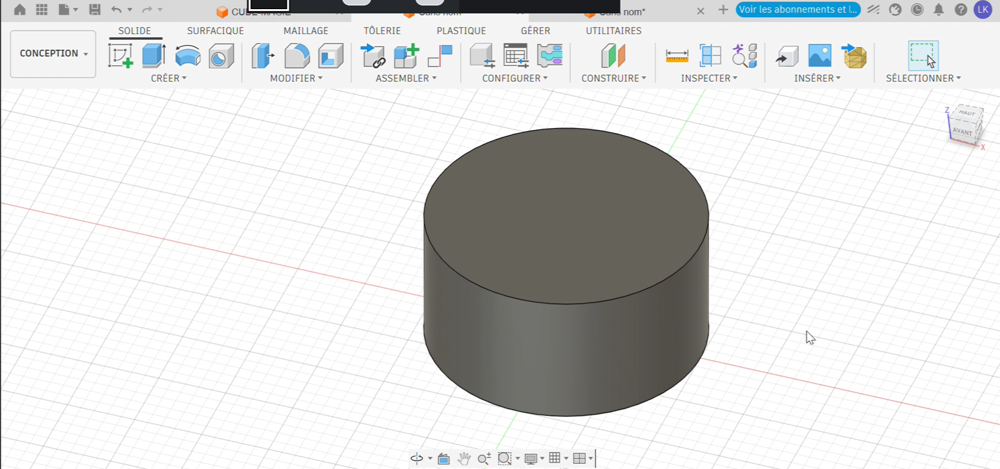
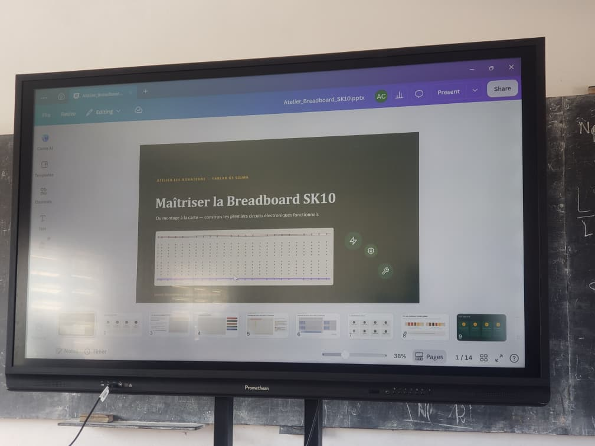
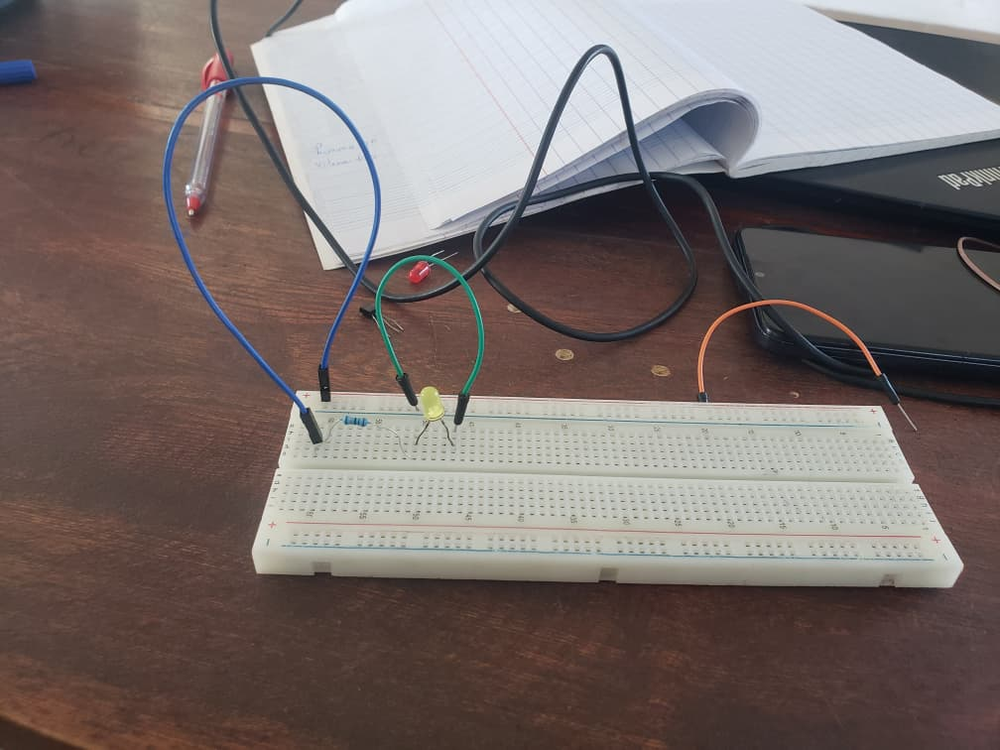
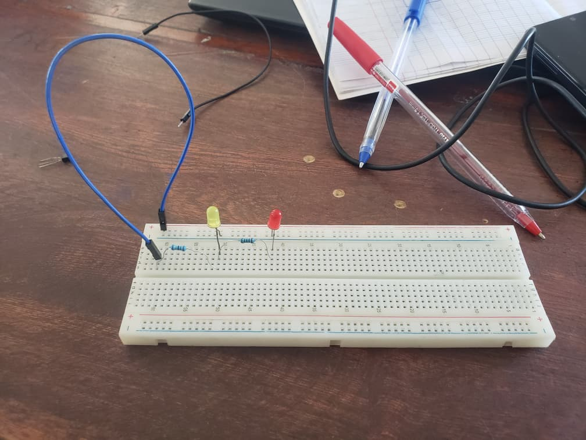
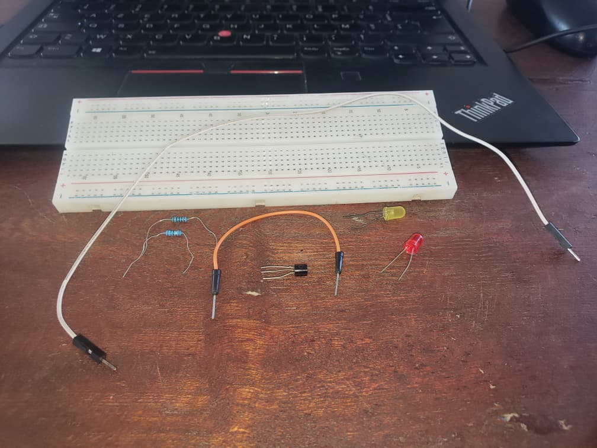
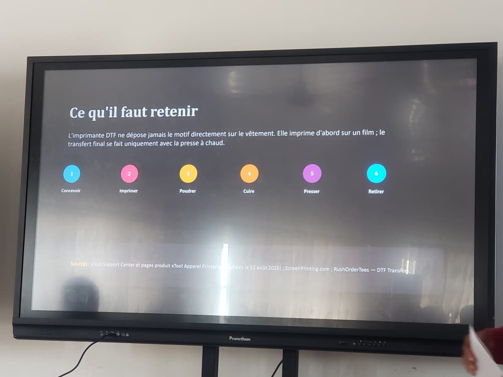

# Journal — Mardi 01 Septembre 2026 (rédigé par Lucas KPEGAN)
---
## Fait aujourd'hui

* **Modélisation & Impression 3D (Fusion 360 & Bambu Studio) :**
* Exploration des 3 méthodes pour modéliser un cylindre dans AutoFusion 3D (Extrusion, Révolution, et outil automatique Cylinder).

* Conception 3D d'un porte-clé personnalisé au nom de "Lucas KPEGAN" (`Porte Clé - Lucas KPEGAN.step`).
* Découpage (Slicing) dans Bambu Studio et exportation des fichiers G-code pour l'impression 3D.

* **Électronique pratique (Atelier Novateurs — FabLab ES SIGMA) :**
* Session pratique "Maîtriser la Breadboard SK10 : Du montage à la carte". 
* Réalisation de 3 montages pratiques sur plaque d'essai : 
* *Montage 1 :* Circuit simple alimentant une LED avec sa résistance de protection. 
* *Montage 2 :* Circuit en dérivation/série avec 2 LED ($L_1$ et $L_2$) et résistances ($R_1, R_2$). 
* *Montage 3 :* Commutation à base de transistor (BC337 / 2N2222) pour piloter une LED.

* **Initiation à l'Impression DTF (Direct to Film) :**
* Suivi du cours théorique sur la technologie d'impression textile DTF (imprimante xTool Apparel Printer).

---
## Appris

* **Architecture de la Breadboard SK10 :**
* Compréhension des bornes d'alimentation (lignes rouges/bleues sur les bords à continuité horizontale).
* Alignement des pistes de connexion au milieu de la carte (continuité verticale par colonne de 5 trous).
* Identification de la polarité d'une LED : la patte la plus longue correspond à l'anode (+), la plus courte à la cathode (-).

* **Composants d'amplification / commutation :**
* Différenciation des types de transistors NPN courants : BC337 et 2N2222 (repérage des broches Base, Collecteur, Émetteur).

* **Processus d'Impression DTF (les 6 étapes clés) :**
1. *Concevoir :* Préparation du motif en haute résolution sur le logiciel (ex: xTool Creative Space).
2. *Imprimer :* Impression des encres CMJN soutenues par une couche de fond blanc sur le film transfert.
3. *Poudrer :* Application de la poudre adhésive thermofusible sur l'encre encore humide.
4. *Cuire :* Fusion de la poudre par passage sous source de chaleur.
5. *Presser :* Transfert du motif sur le vêtement via la presse à chaud.
6. *Retirer :* Pelage du film pour obtenir le visuel final.

---

## Raté, puis corrigé

* Hier j'ai eu beaucoup de mal avec l'interface de Fusion 360, j'ai eu vraiment du mal à suivre malgré son accompagnement. Aujourd'hui j'ai fais l'effort et je suis resté dans le bain du début à la fin.

---
## Décidé

* Valider l'utilisation du transistor (NPN) pour les futurs circuits de commande de puissance du projet.
* Conserver la méthode par Extrusion pour le prototypage rapide des pièces cylindriques sous Fusion 360.

---
## À faire demain

* [ ] Lancer l'impression 3D effective du porte-clé personnalisé (`Porte Clé - Lucas KPEGAN.step`) sur la Bambu Lab.
* [ ] Tester le montage avec capteur de présence (PIR) et LDR sur la breadboard pour le système d'éclairage.
* [ ] Réaliser un premier essai pratique de préparation de film DTF à la presse à chaud.