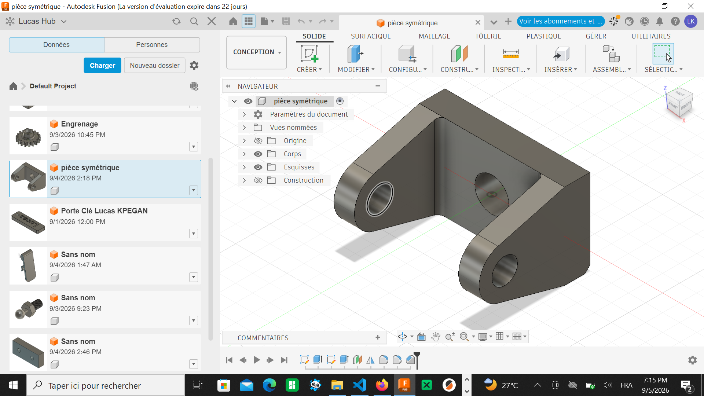
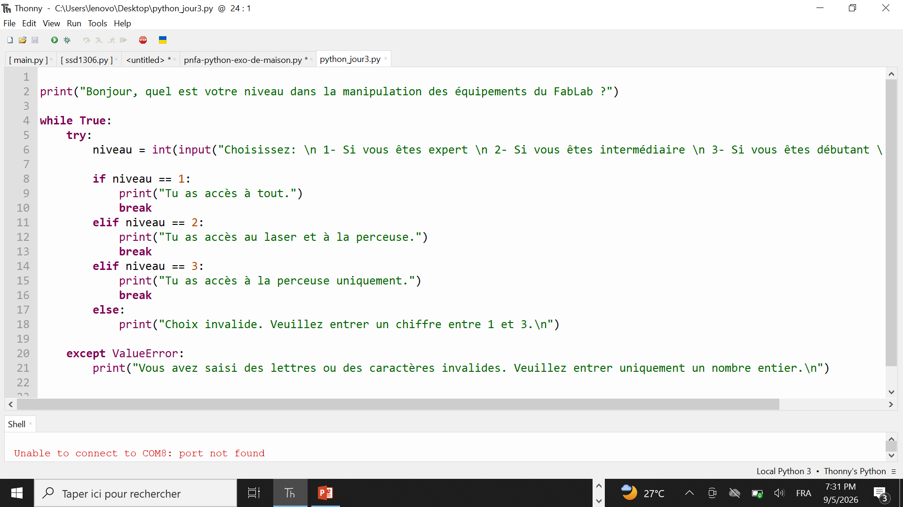

# Journal — Vendredi 4 Septembre 2026 (rédigé par Lucas KPEGAN)
---
## Fait aujourd'hui

* **Fabrication de circuits imprimés (PCB)** : étude du workflow complet en 5 étapes (Schéma électronique → Conception/Routage PCB → Vérification/Export → Fabrication/Assemblage → Tests) et comparaison des logiciels de référence (KiCad, Proteus, EasyEDA, Autodesk Fusion 360).
* **Méthodes de fabrication** : analyse comparative de la gravure chimique (perchlorure de fer, transfert thermique) et de la fabrication numérique (usinage/gravure automatisée).
* **Gravure laser xTool F1 Ultra** : prise en main théorique pour la gravure de plaques cuivre/époxy (automatisation, reproductibilité, rapidité).
* **Directives d'exportation & d'impression** : formats `.pdf` ou `.svg` et application de la règle d'or (interdiction absolue de zoomer le PDF à l'impression pour conserver l'échelle 1:1 exacte des pistes).
* **Optimisation des paramètres** : introduction à la méthode par dichotomie pour déterminer la valeur optimale de puissance/vitesse laser selon le matériau.
* **Dessin technique & modélisation CAO (Fusion 360)** : exercices de cotation et de vues orthographiques avec analyse de pièces mécaniques complexes en vues en coupe (S.F.V / S.T.V), vue de profil et vue en perspective (isométrique) ; prise en compte des contraintes géométriques (perçages $\phi 10$, $\phi 12$, $\phi 18$, $\phi 20$, $\phi 60$, rayons $R5$, $R21$) pour la modélisation 3D sous Autodesk Fusion 360. 

* **Session Python pour Fabmanagers** : révision des opérateurs (arithmétiques, de comparaison, logiques, d'affectation), des structures conditionnelles `if` / `elif` / `else`, des boucles `for` et `while`, ainsi que des listes, tuples et dictionnaires.
* **Exercice 2 — Contrôle d'accès** : écriture du script d'accès machine selon le niveau de formation (`debutant` / `intermediaire` / `expert`) combiné à la vérification de disponibilité via `and`.
* **Exercice 3 — Suivi de production** : mise en œuvre d'une boucle `for` (numérotation des pièces, contrôle qualité sur les multiples de 5 avec `%`), d'une boucle `while` (décompte de stock) et de l'instruction `break`. 

---
## Appris

* **Fabrication PCB** : le PCB est l'aboutissement d'une chaîne évoluant de la breadboard au circuit câblé jusqu'à la plaque finalisée, garantissant un ensemble fiable, compact et reproductible.
* **Gravure laser** : la précision dépend du respect strict de l'échelle 1:1 à l'impression et d'un réglage puissance/vitesse optimisé par dichotomie.
* **Logique conditionnelle** : `if` teste une condition, `elif` ajoute des alternatives et `else` gère le reste ; l'indentation (4 espaces) délimite les blocs et les deux-points `:` sont obligatoires en fin de ligne.
* **Boucles** :
```python
for i in range(5):      # génère 0, 1, 2, 3, 4
for i in range(1, 11):  # génère 1 à 10
while stock > 0:        # s'exécute tant que la condition est vraie

```


`break` interrompt immédiatement la boucle, `continue` passe à l'itération suivante.
* **Structures de données** :
* *Listes* : ordonnées, modifiables, acceptant les doublons (`.append()`, `.remove()`, `len()`, slicing `[début:fin]`, `.sort()`).
* *Tuples* : immuables, adaptés aux valeurs fixes (ex. `dimensions = (300, 200)`).
* *Dictionnaires* : associations clé $\rightarrow$ valeur pour accès direct (ex. `tarifs["laser"]`).


---

## Raté, puis corrigé

**Erreur :** Dans l'exercice 3, la boucle `while` de décompte de stock ne s'arrêtait pas comme prévu lors du premier essai.

**Hypothèse :** La décrémentation `stock -= 1` avait été placée à l'extérieur du bloc indenté de la boucle, se retrouvant hors de la condition testée.

**Correction :** Réindentation du bloc pour intégrer la décrémentation dans le corps du `while`.

**Résultat :** Le stock se décompte correctement jusqu'à 0 et le message final s'affiche une seule fois.

---

## Décidé

* Systématiser l'usage du reste de la division (`% 5 == 0`) pour toute détection de multiple dans les futurs scripts de suivi de production.
* Toujours vérifier l'échelle 1:1 avant l'impression d'un fichier destiné à la xTool F1 Ultra.

---

## À faire demain

* [ ] Terminer et déboguer les exercices 2 et 3 (contrôle d'accès + suivi de production) — *Lucas*
* [ ] Préparer un dictionnaire de tarifs machines pour un exercice combiné listes/dictionnaires — *Lucas*