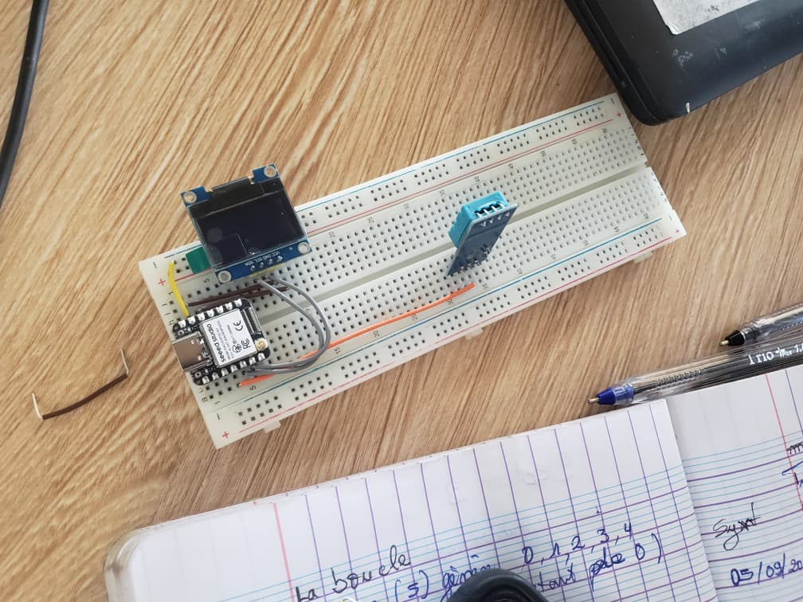
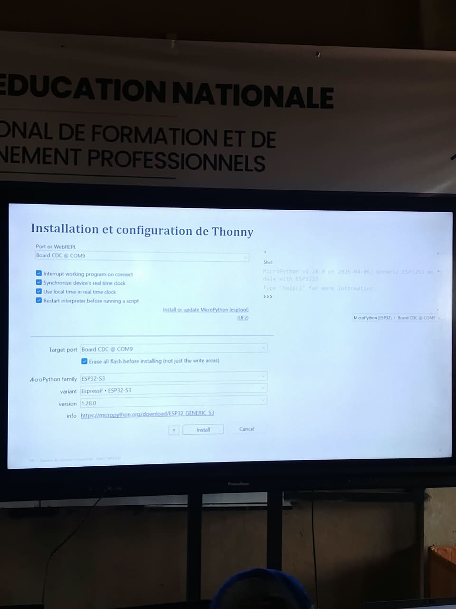
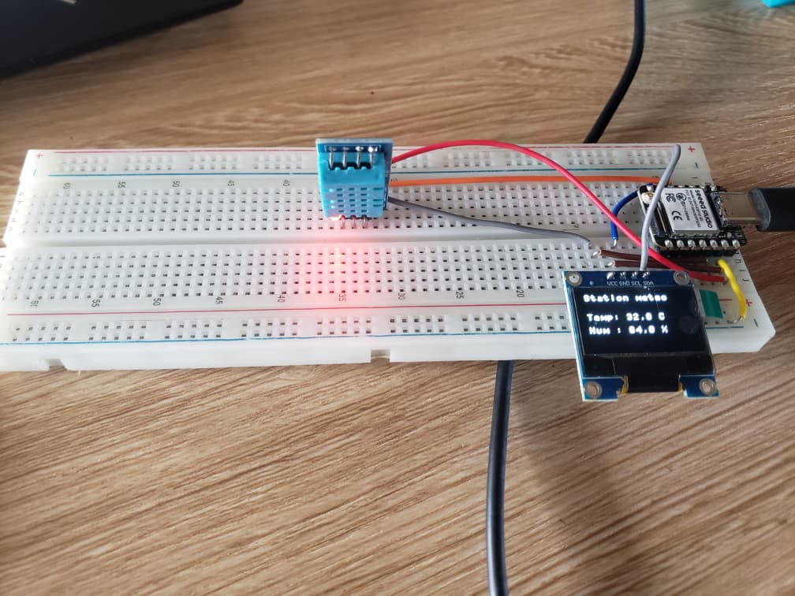

# Journal — Samedi 5 Septembre 2026 (rédigé par Lucas KPEGAN)
---
## Fait aujourd'hui

* **Projet Pratique — Station météo / température intelligente** :
* **Assemblage matériel sur breadboard** : interfaçage d'une carte Seeed Studio XIAO ESP32-S3, d'un écran OLED I2C (128x64) et d'un capteur de température et d'humidité (DHT11 sur la broche GPIO4) à l'aide de câbles Dupont.
* **Alimentation & Connexion** : raccordement du circuit au PC via un câble USB Type-C.

* **Flashage & Configuration du firmware** : installation de MicroPython (`MicroPython v1.28.0` / `ESP32-S3 Espressif`) sur le XIAO ESP32-S3 via le menu de Thonny IDE (*Tools* $\rightarrow$ *Options* $\rightarrow$ *Interpreter*, sélection du port `Board CDC @ COM9`).

* **Déploiement du code** : transfert et sauvegarde du driver d'affichage `ssd1306.py` et du script principal `main.py` directement sur le stockage MicroPython du microcontrôleur.
* **Exécution & Affichage** : affichage en temps réel des données sur l'écran OLED (`Station meteo`, `Temp : X.X °C`, `Hum : X.X %`).

---

## Appris

* **Workflow MicroPython sur ESP32** : maîtrise du processus complet, du flashage du firmware avec Thonny IDE à l'exécution de scripts autonomes enregistrés localement sur la carte.
* **Gestion des périphériques I2C & GPIO** :
* Déclaration et initialisation du bus I2C (`I2C(0, scl=Pin(6), sda=Pin(5), freq=400000)`).
* Pilotage de l'écran OLED SSD1306 via les méthodes `.fill()`, `.text()` et `.show()`.

* **Sensibilité des drivers de capteurs** : différence d'interprétation des données brutes entre les protocoles DHT11 et DHT22 ; une mauvaise instanciation de la classe (`dht.DHT22` au lieu de `dht.DHT11`) fausse la conversion binaire et génère des valeurs aberrantes.

---

## Raté, puis corrigé

**Erreur :** Lors du premier lancement du script `main.py`, la température affichée sur l'écran OLED indiquait une valeur extrêmement élevée et irréaliste.

**Hypothèse :** Le code source utilisait l'instruction `capteur = dht.DHT22(Pin(4))` alors que le composant physique câblé sur la breadboard était un capteur DHT11 (boîtier bleu).

**Correction :** Modification du constructeur dans `main.py` pour instancier la bonne classe : `capteur = dht.DHT11(Pin(4))`.

**Résultat :** Les relevés de température et d'humidité se sont immédiatement stabilisés et ont affiché les valeurs ambiantes exactes.

---

## Décidé

* Toujours vérifier la référence exacte des composants matériels (capteurs, modules) avant d'importer ou d'exécuter un script Python préécrit.
* Structurer les projets IoT MicroPython en séparant systématiquement les drivers (`ssd1306.py`) du programme principal (`main.py`).

---

## À faire demain

* [ ] Ajouter un bloc de gestion des exceptions (`try...except`) dans la boucle `while True` pour éviter que le script ne plante en cas d'erreur de lecture du capteur DHT — *Lucas*
* [ ] Tester l'ajout d'un délai d'actualisation (`time.sleep(2)`) pour respecter le temps de rafraîchissement optimal du capteur DHT11 — *Lucas*