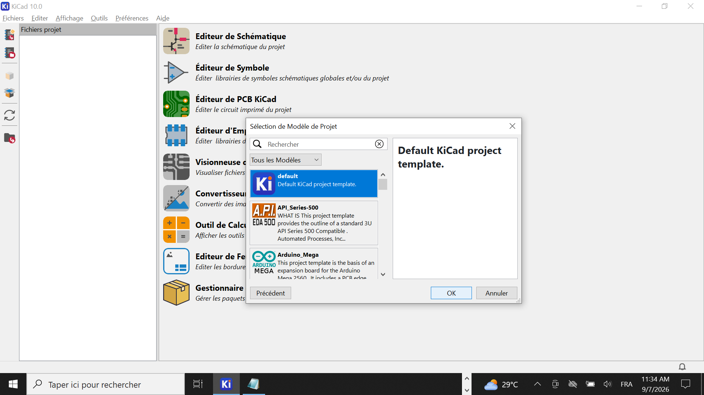
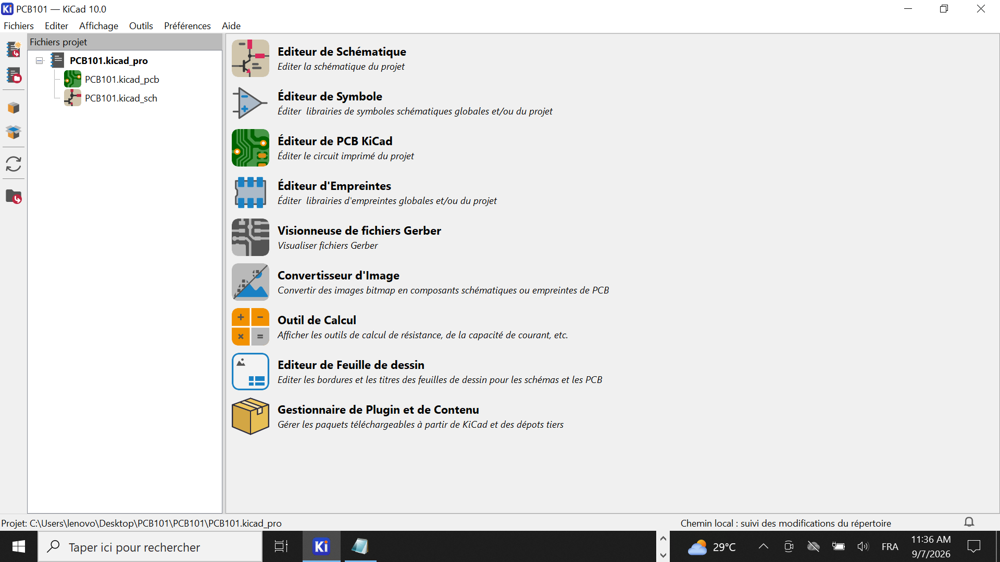
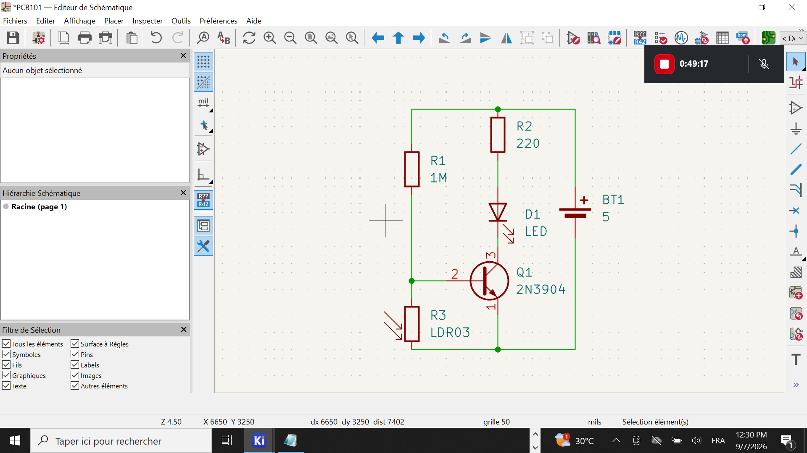
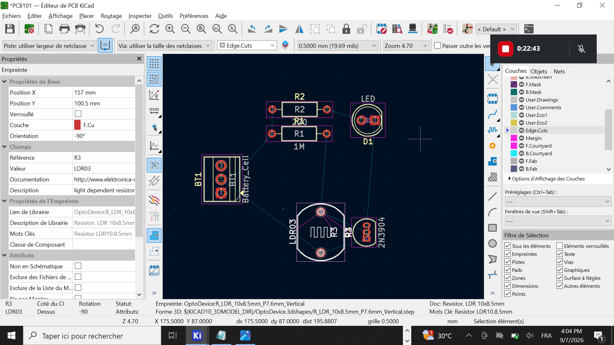
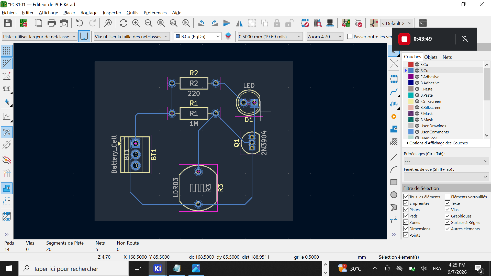
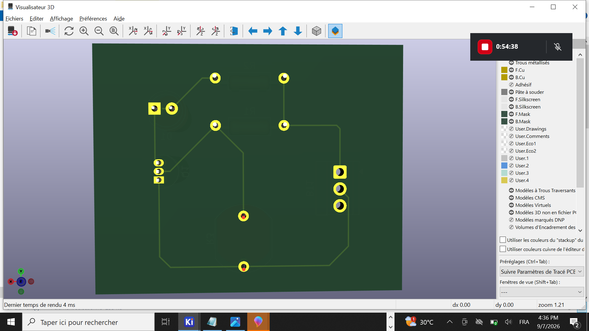

# Journal — Lundi 7 Septembre 2026 (rédigé par Lucas KPEGAN)
---
## Fait aujourd'hui

* **Échanges préalables & organisation** :
* Discussion sur divers sujets notamment : l'aspect financier lié à la formation, le processus de notation des documentations pour le projet final, et les modalités de la certification.
* Téléchargement et installation du logiciel KiCad sur les postes.
* Questionnaires d'introduction sur la définition et le rôle d'un circuit PCB.
* Échanges sur les concepts fondamentaux de FabLab et de la philosophie Open Source.

* **Début du cours d'initiation aux PCB : De l'idée au circuit imprimé** (dirigé par Arnauld Kpadenou) :
* **Objectifs du cours** : comprendre le rôle d'un PCB, ses couches, la chaîne de conception, le routage, la fabrication et les tests.
* **Pourquoi passer du prototypage au PCB ?**
* *Breadboard* : idéale pour tester rapidement une idée, mais présente des limites majeures (câblage volumineux et fragile, connexions moins fiables, sensibilité aux vibrations, difficile à dupliquer).
* *PCB* : solution permanente, compacte et fiable (réduction de la taille et du câblage, connexions solides et répétables, meilleure résistance aux vibrations, fabrication facile en plusieurs exemplaires).

* **Anatomie d'un PCB** : étude des 7 éléments clés qui composent un circuit imprimé :
1. Substrat
2. Cuivre
3. Masque de soudure (*Solder mask*)
4. Sérigraphie (*Silkscreen*)
5. Pastilles (*Pads*)
6. Vias
7. Trous de montage (*Mounting holes*)

* **Partie pratique sur KiCad (Projet PCB101)** :
 **Installation de Kicad via ce lien**: https://www.kicad.org/download/windows/ 

* **Création du projet & Choix de l'environnement de travail** : ouverture de KiCad, création du dossier `PCB101` sur le bureau et ouverture de ce dossier dans l'environnement KiCad pour lancer la création du circuit.

 
* **Saisie du schéma électronique** :
* Importation des composants matériels utiles au projet : deux résistances, une photo-résistance (LDR), un transistor, une LED, une borne positive fléchée $+5\text{V}$ et une borne négative $\text{GND}$ appelée masse.
* Disposition des composants sur la feuille technique et réalisation des connexions avec l'outil de liaison (fils électriques).
* Attribution des valeurs aux composants : $220\ \Omega$ pour la deuxième résistance et $1\ \mu\Omega$ pour la première.

* **Contrôle des règles électriques (ERC)** :
* Exécution du bouton ERC : deux erreurs d'alimentation sont survenues lors du contrôle.
* Résolution des deux erreurs en ajoutant un composant batterie (`battery-cell`) pour alimenter correctement le circuit.

* **Assignation des empreintes & passage au PCB** :
* Ouverture de l'onglet d'enregistrement des empreintes pour choisir les caractéristiques physiques des composants électriques du circuit.
* Enregistrement des empreintes puis basculement vers l'onglet d'édition PCB.
* Importation du dessin sur la nouvelle feuille technique du PCB, repositionnement correct des composants et tracé de la bordure tout autour du circuit (*Edge.Cuts*).

* **Redisposition des composantes éléctriques**:

* **Routage & Rendu 3D** :
* Traçage des pistes de connexion électriques (routage) entre les différents pads des composants.
* Passage en mode de visualisation 3D avec le raccourci clavier `Alt + 3` pour observer le rendu final de la carte.

---

## Appris

* **Différence Breadboard vs PCB** : la breadboard est parfaite pour valider un concept, mais la transition vers un PCB est indispensable pour créer un produit finalisé, résistant aux vibrations et facilement duplicable.
* **Anatomie d'un circuit imprimé** : rôle et superposition des 7 éléments (substrat, cuivre, solder mask, silkscreen, pads, vias, mounting holes).
* **Rôle du contrôle ERC dans KiCad** : l'outil ERC détecte immédiatement les erreurs de continuité et les problèmes de masse/tension flottante (comme l'absence d'une source d'alimentation explicite).
* **Processus complet de conception** :

$$\text{Schéma théorique} \longrightarrow \text{Test ERC} \longrightarrow \text{Association des empreintes} \longrightarrow \text{Bordure \& Routage PCB} \longrightarrow \text{Visualisation 3D}$$

---
## Raté, puis corrigé
**Erreur :** Lors de l'exécution du contrôle des règles électriques (ERC) dans le schéma KiCad, le logiciel a renvoyé deux erreurs.

**Hypothèse :** Les bornes d'alimentation $+5\text{V}$ et $\text{GND}$ n'étaient reliées à aucune source d'énergie active identifiée par KiCad.

**Correction :** Ajout d'une batterie (`battery-cell`) sur le schéma pour fournir une source de tension explicite au circuit.

**Résultat :** Les erreurs ERC ont été immédiatement résolues, permettant de valider le schéma et de procéder à l'attribution des empreintes.

---

## Décidé

* Faire l'exercice de recherche à la maison sur les composants électriques fondamentaux et leurs symboles normalisés.
* Adopter la méthode systématique d'ajouter une source d'alimentation (`battery-cell` ou connecteur dédié) dès la création du schéma dans KiCad pour éviter de rebloquer sur l'ERC.

---

## À faire demain

* [ ] Réaliser l'exercice de recherche à la maison sur les composants électriques et leurs symboles — *Lucas*
* [ ] Vérifier et ajuster l'épaisseur des pistes du projet `PCB101` avant la phase de préparation à la fabrication — *Lucas*

