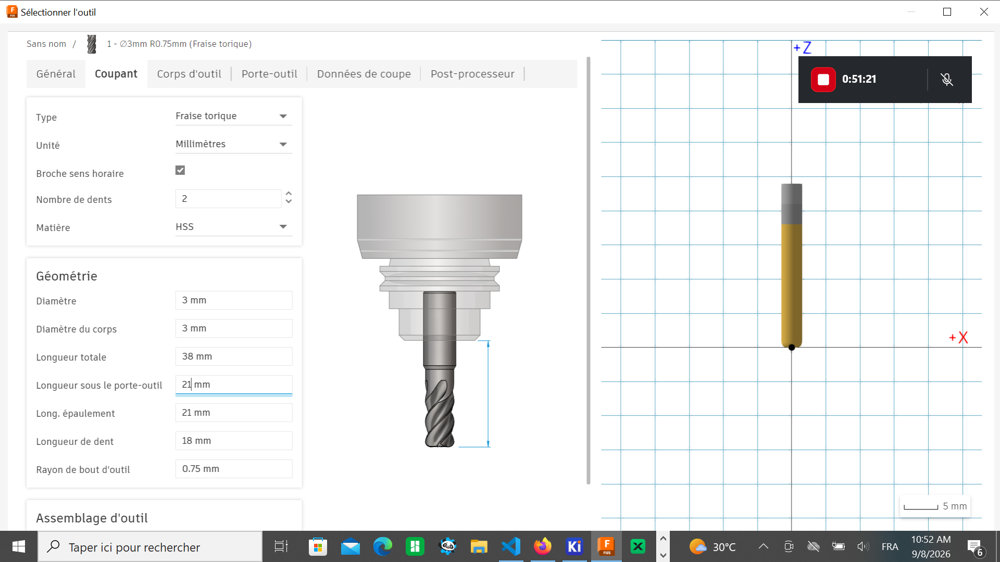
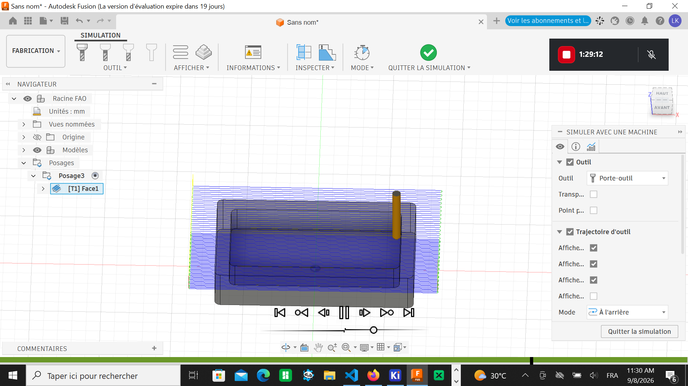
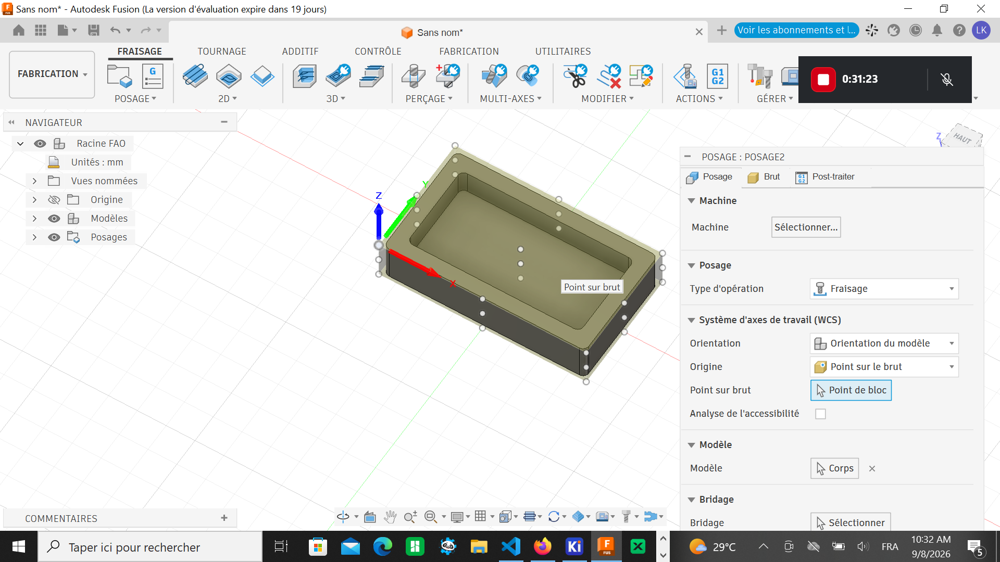

# Journal — Mardi 8 Septembre 2026 (rédigé par Lucas KPEGAN)
---
## Fait aujourd'hui

* **Module FAO / CAM (Fabrication Assistée par Ordinateur)** :
* **Principe fondamental** : la FAO fait le pont entre la CAO (modélisation 3D sous Fusion 360) et la fabrication mécanique en traduisant le modèle en instructions numériques (G-code) pour une fraiseuse CNC.
* **Workflow de fabrication sous Fusion 360** :
1. **Setup** : définition du type de machine, orientation des axes, origine pièce (WCS) et dimensions du brut (*Stock*).
2. **Bibliothèque d'outils** : sélection/création d'outils de coupe (raccourci `Ctrl + N` pour ajouter une nouvelle fraise).
3. **Stratégies d'usinage** : programmation des passes d'ébauche (*Roughing* pour retirer la masse), de finition (*Finishing* pour l'état de surface), de perçage (*Drilling*) et de poche (*Pocket*).

4. **Simulation** : contrôle visuel des trajectoires et détection d'éventuelles collisions.

5. **Post-traitement** : conversion des trajectoires calculées vers un fichier G-code (`.nc` / `.tap`) grâce au post-processeur de la machine cible.

* **Contrôle des paramètres de coupe** : ajustement de la vitesse de coupe, de la vitesse d'avance, de la profondeur de passe et de l'engagement radial selon l'outil et le matériau.

* **CAO orientée usinage & Préparation CNC** :
* **Modélisation** : conception d'un bloc rectangulaire avec coque sous Fusion 360 (recommandation : éviter les chanfreins et congés inutiles en ébauche).

* **Contraintes du brut** : calibrage strict de la hauteur du brut virtuel dans la FAO pour qu'elle corresponde exactement à la pièce réelle.
* **Mise en route CNC** : définition du zéro pièce physique ($X=0$, $Y=0$, $Z=0$) et orientation correcte de la buse/broche avant d'usiner.

* **Chaîne d'exportation** :

$$\text{Modèle CAO (Fusion 360)} \longrightarrow \text{Post-Processeur} \longrightarrow \text{G-Code} \longrightarrow \text{VS Code} \longrightarrow \text{Candle} \longrightarrow \text{Usinage CNC}$$

* **Projet pratique — Coffre-fort intelligent (Smart Safe)** :
* Découpe des tiges et panneaux de contreplaqué.
* Réalisation d'une part importante de l'assemblage de la structure physique.

---

## Appris

* **Continuité numérique** : la FAO transforme une forme géométrique passive en un ensemble d'actions dynamiques (trajectoires d'outils).
* **Règles d'or de l'usinage CNC** :
* La simulation numérique est obligatoire avant le lancement physique pour éviter de casser l'outil.
* La hauteur du brut virtuel doit refléter au millimètre près l'épaisseur du matériau réel.
* Le calage du point zéro ($X, Y, Z$) conditionne l'intégralité de la précision de la pièce.

* **Chaîne logicielle** : l'utilisation conjointe de VS Code (pour relire le G-code généré) et de Candle (pour piloter l'envoi des commandes à la machine) permet un contrôle total de la fabrication.

---

## Raté, puis corrigé

**Erreur :** Risque de décalage d'usinage ou de choc d'outil si le repère virtuel ne correspond pas au repère physique de la machine.

**Hypothèse :** Mauvaise concordance des dimensions du brut (*Stock*) ou origine pièce ($Z=0$) mal positionnée dans le *Setup* de Fusion 360 par rapport au matériau monté sur la CNC.

**Correction :** Alignement strict de la hauteur du brut FAO sur la mesure physique réelle du matériau et exécution systématique de la remise à zéro des axes $X, Y, Z$ sur la fraiseuse.

**Résultat :** Trajectoires de découpe fluides, sécurisées et conformes aux cotes souhaitées.

---

## Décidé

* Toujours contrôler visuellement le fichier G-code exporté (via VS Code et la prévisualisation Candle) avant de démarrer la broche.
* Sécuriser la fixation du brut sur le plateau martyr pour éviter toute vibration durant les passes d'ébauche.

---

## À faire demain

* [ ] Lancer les opérations de fraisage des éléments restants sur la CNC via Candle — *Lucas*
* [ ] Poursuivre le montage mécanique du coffre-fort intelligent — *Lucas*
* [ ] Préparer la zone d'intégration des composants électroniques (verrouillage, écran/servomoteur) dans le coffre-fort — *Lucas*