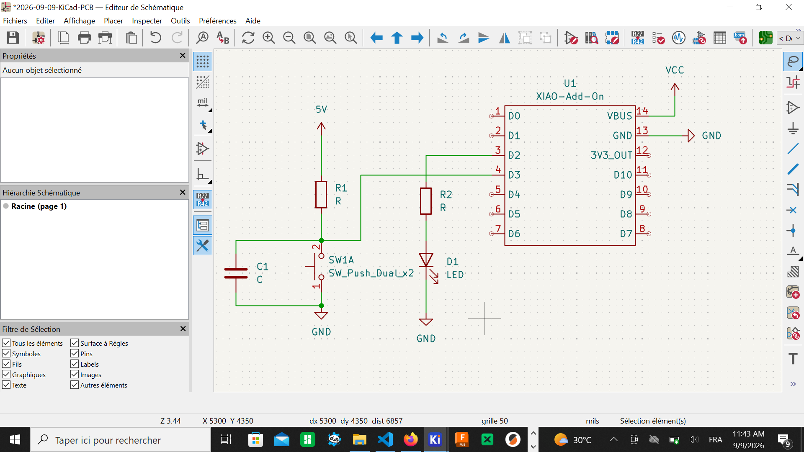
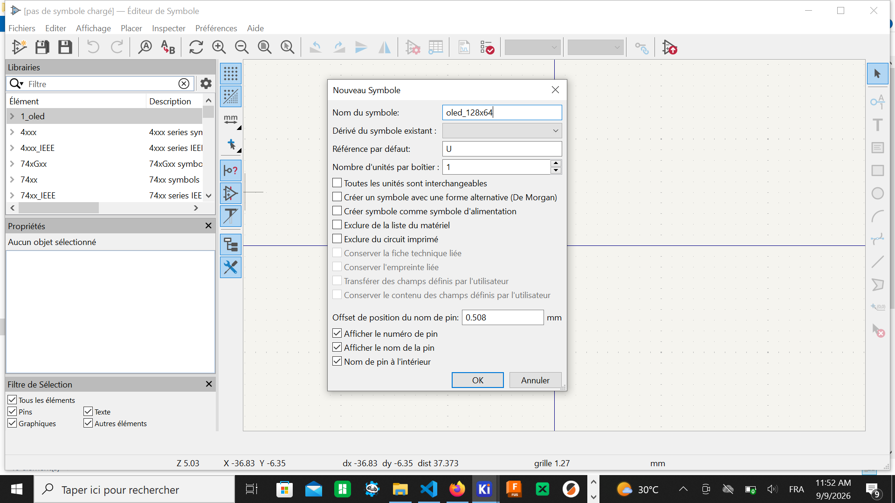
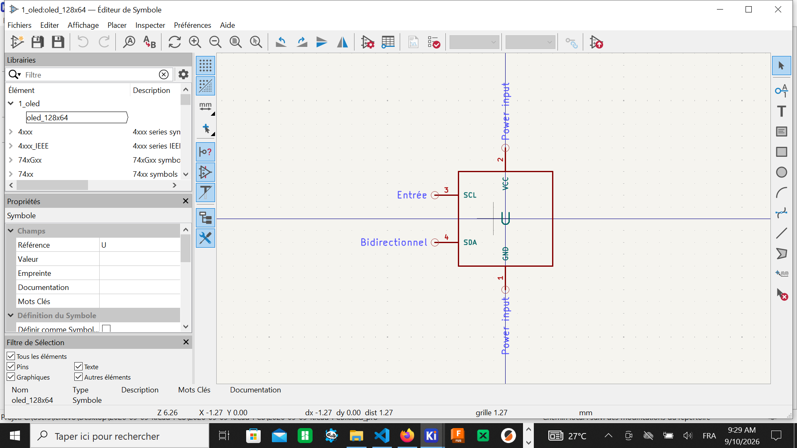
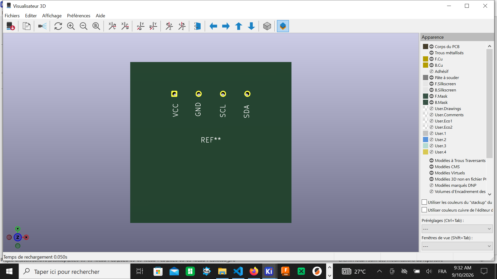
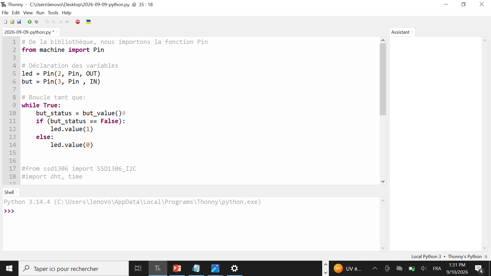

# Journal — Mercredi 9 Septembre 2026 (rédigé par Lucas KPEGAN)
---
## Fait aujourd'hui
* **Conception de Schématique sur KiCad** :

* Modélisation du circuit autour du microcontrôleur **XIAO-Add-On** (`U1`).
* Câblage des composants périphériques :
* Un bouton-poussoir (`SW1A` / `SW_Push_Dual_x2`) associé à un condensateur anti-rebond `C1` et une résistance de rappel (*pull-up*) `R1` reliée au $+5\text{V}$, connectés à la broche `D3` (Pin 4).
* Une LED indicatrice `D1` protégée par une résistance `R2`, pilotée par la broche `D2` (Pin 3).
* Raccordement de l'alimentation générale sur `VBUS` (Pin 14) et de la masse globale `GND` (Pin 13).

* **Création personnalisée du symbole de l'écran OLED (`oled_128x64`)** :
* Ouverture de l'**Éditeur de Symboles** pour créer un nouveau symbole `oled_128x64` dans la bibliothèque `1_oled`.

* Configuration et ajout des 4 broches fonctionnelles de l'afficheur I2C (ex. broche `1` définie comme `GND` de type *Power input*, puis ajustement de l'orientation, de la longueur des pins à $2.54\text{ mm}$ et de la taille du texte).

* **Création & Paramétrage de l'empreinte PCB (`1_oled_print`)** :
* Passage dans l'**Éditeur d'Empreintes** pour dessiner le contour physique du module sur la couche de sérigraphie (`F.Silkscreen`).
* Tracé d'un rectangle de dimension $28\text{ mm} \times 28\text{ mm}$ (du point X: $-13.5$, Y: $-13.5$ au point X: $14.5$, Y: $14.5$).
* Utilisation de l'outil *Convertir en Zones avec Règles* pour définir l'enveloppe du composant et gérer les zones interdites (exclusion des pistes, vias et pads).
* Validation du rendu 3D de la carte dans le **Visualisateur 3D** KiCad pour contrôler l'aspect de la plaque et de la sérigraphie (`REF**`).

* **Initiation Thonny IDE & Programmation MicroPython** :
* Revue des 6 piliers de la programmation : *commentaires, structures conditionnelles, boucles, variables, fonctions, opérateurs (arithmétiques & logiques)*.
* Rédaction du code pour l'initialisation du bus I2C et l'affichage dynamique de texte sur l'écran OLED $128 \times 64$.

---
## Appris
* **Création complète de composant de A à Z** : quand un module (comme l'écran OLED) manque dans la bibliothèque de base, il faut créer à la fois son **symbole schématique** (Éditeur de Symboles) et son **empreinte physique** (Éditeur d'Empreintes).
* **Gestion des règles de sérigraphie (`F.Silkscreen`)** : l'enveloppe d'un composant doit respecter des dimensions réelles exactes (ici $28 \times 28\text{ mm}$) pour éviter que d'autres composants ne se chevauchent lors de l'assemblage.
* **Fonctionnement du Visualisateur 3D** : il permet de vérifier l'absence d'erreurs graphiques ou de superpositions de texte avant de lancer la fabrication du circuit imprimé.

---
## Raté, puis corrigé
**Erreur :** Le symbole de l'écran OLED et son empreinte PCB n'existaient pas dans les bibliothèques par défaut de KiCad.
**Hypothèse :** Les modules d'affichage OLED $128 \times 64$ standards ou les cartes XIAO nécessitent des empreintes personnalisées avec des écarts de broches spécifiques.
**Correction :**
1. Création du symbole `oled_128x64` avec ses 4 pins (`GND`, `VCC`, etc.) dans la librairie `1_oled`.
2. Création de l'empreinte `1_oled_print` de $28\times28\text{ mm}$ avec exclusion de zone sur la couche `F.Silkscreen`.
**Résultat :** Le composant est parfaitement modélisé en 2D et prévisualisable en 3D dans KiCad.

---
## Décidé
* Toujours créer une sérigraphie explicite (`F.Silkscreen`) avec les vraies dimensions matérielles pour faciliter le positionnement manuel des composants sur la carte.
* Utiliser Thonny IDE comme environnement principal pour tester rapidement les scripts MicroPython sur les cartes ESP32/XIAO.

---
## À faire demain
* [ ] Compléter le câblage schématique en reliant les broches I2C du XIAO (`D4`/`D5` ou `SDA`/`SCL`) à l'écran OLED — *Lucas*
* [ ] Placer les pads de connexion sur l'empreinte OLED et effectuer le routage final du PCB — *Lucas*

