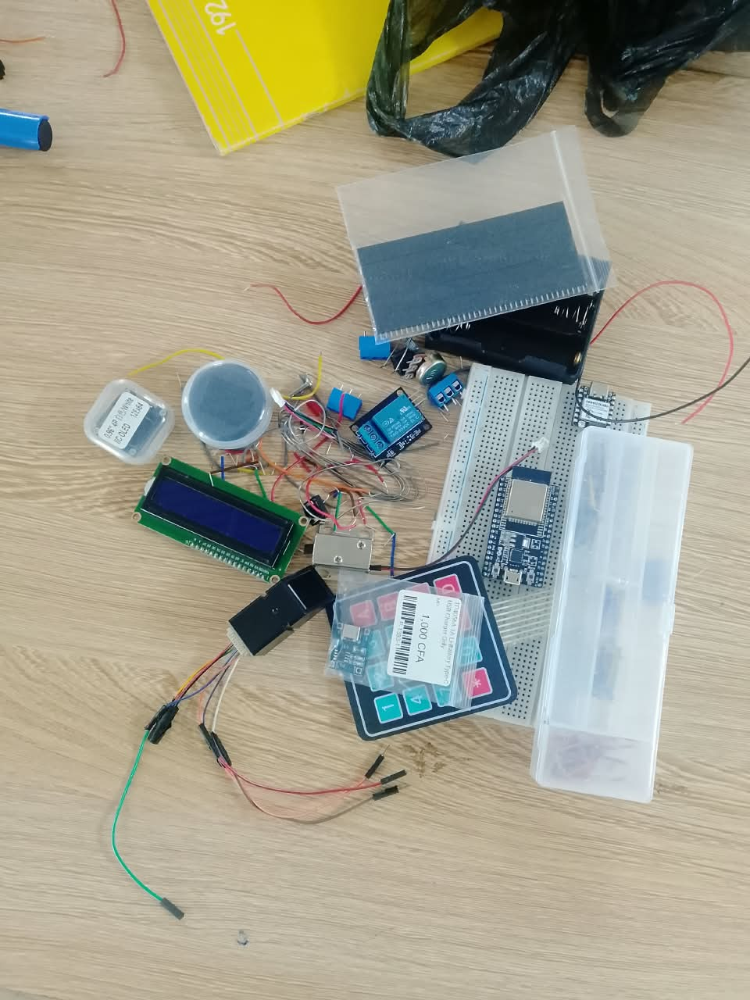
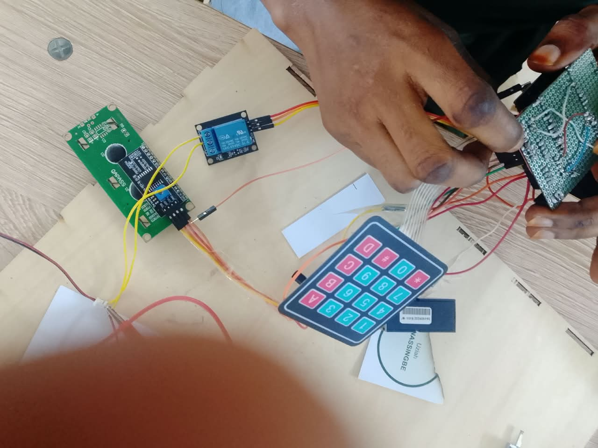

# Journal — Samedi 12 Septembre 2026 (rédigé par Lucas KPEGAN)
---
## Fait aujourd'hui

Dans le cadre de la formation des FabLab Managers, nous avons poursuivi en équipe la conception et la réalisation de notre prototype de **« Coffre-fort intelligent »**.

* **Inventaire & Vérification du matériel** :
* Réception, identification et vérification de la liste des composants matériels.
* Contrôle systématique de l'état des composants avant leur intégration au circuit.

* **Configuration de l'environnement de développement** :
* Connexion du microcontrôleur **XIAO ESP32-S3** à l'ordinateur via un câble USB-C.
* Flashage du firmware MicroPython et configuration du port série dans l'IDE Thonny.

* **Tests du clavier matriciel, de l'écran et du solénoïde** :
* Premiers essais du solénoïde de verrouillage : échec au premier test, puis correction des branchements et ajustement du code MicroPython.
* Nouveaux essais concluants pour le clavier matriciel et le solénoïde.

* **Transition d'affichage : Remplacement de l'écran OLED par un écran LCD** :
* Substitution de l'écran OLED par un écran LCD pour les essais d'affichage.
* **Essai 1** : Échec d'affichage.
* **Essai 2** : Vérification et réajustement du câblage I2C/broches avec le XIAO ESP32-S3 (résultat toujours non conforme).
* **Essai 3** : Correction des adresses et instructions logicielles dans le script MicroPython $\rightarrow$ **Succès et affichage fonctionnel**.

* **Test des actionneurs & Commande de puissance** :
* Intégration d'une source d'alimentation externe dédiée pour la ligne de puissance du solénoïde.
* Pilotage du solénoïde via un module relais relié aux sorties numériques du XIAO ESP32-S3.
* Validation du bouton-poussoir de secours et vérification générale de l'étage de puissance (**validé à 100 %**).

* **Branchement des résistances et des LED** :
* Montage et câblage des résistances de protection et des LED indicatrices de statut.
* Validation des voyants lumineux : le circuit principal est désormais presque complet.

---
## Appris

* **Diagnostic systématique du matériel (*Hardware-in-the-loop*)** : Tester individuellement chaque composant sur banc d'essai avant montage final évite d'intégrer des éléments défaillants ou mal câblés sur le circuit imprimé (PCB).
* **Isolation de l'étage de puissance** : Le XIAO ESP32-S3 fonctionnant en logique 3,3 V, il ne doit pas alimenter directement un composant inductif à forte consommation comme un solénoïde. L'utilisation d'une alimentation externe couplée à un relais garantit la protection du microcontrôleur et la fiabilité du verrouillage.
* **Processus itératif de prototypage** : La résolution des échecs successifs sur l'écran LCD et le clavier démontre qu'un prototype nécessite une alternance rigoureuse entre vérification du câblage physique et débogage logiciel.

---
## Raté, puis corrigé

**Erreur :** Lors du premier test du clavier matriciel $4 \times 4$, seule la touche « `*` » envoyait une valeur dans le terminal Thonny. De plus, les deux premiers essais d'affichage sur le nouvel écran LCD sont restés infructueux.

**Hypothèse :**
1. Pour le clavier : usure mécanique et oxydation interne des pistes en raison de l'ancienneté du module.
2. Pour l'écran LCD : mauvais adressage I2C ou erreur dans la séquence d'initialisation du driver en MicroPython.

**Correction :**
1. Remplacement du clavier défectueux par un second module $4 \times 4$ neuf.
2. Vérification point par point des connexions physiques sur le XIAO ESP32-S3 et réécriture de la logique d'initialisation de l'écran LCD sous Thonny.

**Résultat :** Saisie correcte des codes sur le nouveau clavier et affichage réussi des messages sur l'écran LCD au 3ᵉ essai.

---
## Décidé
* Ne souder sur le PCB définitif que les composants préalablement testés et validés sur le banc d'essai.
* Maintenir une séparation stricte entre le circuit de commande logique (XIAO ESP32-S3) et la ligne de puissance (alimentation externe du solénoïde).
* Valider impérativement le fonctionnement du lecteur d'empreinte digitale avant de figer le routage final du PCB.

---

## À faire demain
* [ ] Effectuer le branchement et le test individuel du détecteur d'empreinte digitale sur le XIAO ESP32-S3 — *Lucas*
* [ ] Réaliser le test d'intégration globale (clavier LCD + empreinte + relais/solénoïde) — *Lucas*
* [ ] Procéder aux derniers ajustements du code MicroPython d'ouverture sécurisée — *Lucas*
* [ ] Lancer la conception du schéma et du PCB sous KiCad à partir des composants validés — *Lucas*
* [ ] Documenter l'ensemble des essais par photos et vidéos pour la synthèse de formation — *Lucas*