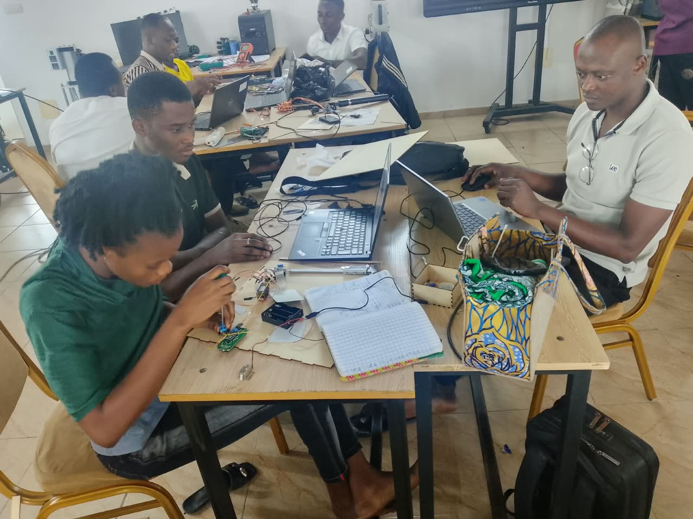
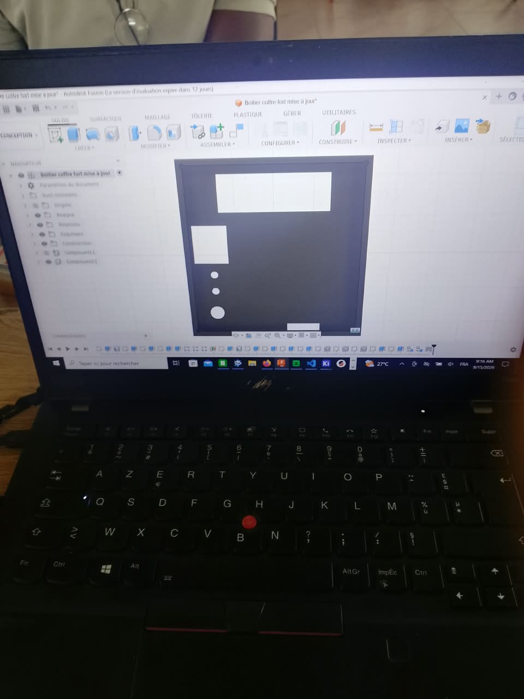

# Journal — Lundi 14 Septembre 2026 (rédigé par Lucas KPEGAN)
---
## Fait aujourd'hui

En cette journée d'assemblage et d'intégration, notre équipe a franchi une étape majeure dans la concrétisation du prototype du **Coffre-fort intelligent** en combinant la fabrication mécanique et la validation globale du circuit.

* **Fabrication mécanique & Intégration du boîtier** :
* **Découpe laser (X-Tool)** : Découpe précise des panneaux de bois constituant la structure du coffre-fort après prise de mesures rigoureuses au mètre ruban.
* **Impression 3D** : Impression et préparation du boîtier sur mesure destiné à protéger les composants électroniques.
* **Assemblage mécanique** : Montage de la structure principale du coffre-fort et fixation du mécanisme de verrouillage du solénoïde.

* **Câblage & Intégration électronique sur ESP32-WROOM-32D** :
* Raccordement complet de la chaîne de composants : capteur d'empreinte digitale (UART), clavier matriciel, écran LCD (I2C), module relais / solénoïde, LED de statut et **buzzer sonore**.
* Réalisation des connexions physiques entre l'ESP32-WROOM-32D et les différents modules sur la carte de prototypage.

* **Dépannage & Reprogrammation sous MicroPython** :
* Test individuel et conjoint de l'écran LCD, du buzzer d'alarme et du lecteur biométrique.
* Correction du code MicroPython pour ajuster les signaux du buzzer (bips de confirmation et d'erreur) et optimiser la boucle d'acquisition du capteur d'empreinte.
[Dépannage & Reprogrammation sous MicroPython](../medias/2026-09-16-Depannage&Reprogrammation-sous-MicroPython.jpeg)

* **Conception 3D du boitier-éléctronique pour le coffre-fort** :
* Mésure des composants éléctroniques avec un pied à coulisse et ensuite dimensionnement du boitier dans le logiciel Fusion 360
* Plusieurs tentatives d'impressions du boitier dans la salle imprimante 3D, plusieurs groupes patientaient que l'impression en cours finisse pour lancer leur impression, il a fallu attendre le soir et prendre le fichier de plusieurs groupes et le slicer sur un même plateau

---
## Appris

* **Usinage & Découpe laser (X-Tool)** : Prise en main du processus de découpe sur bois, en intégrant l'importance critique de la précision des mesures au mètre ruban pour garantir l'ajustement parfait des panneaux du coffre-fort.
* **Câblage structuré sur ESP32-WROOM-32D** : Organisation et repérage des liaisons GPIO, UART et I2C lors du raccordement simultané de multiples périphériques sur le microcontrôleur.
* **Signalisation sonore sous MicroPython** : Gestion du pilotage d'un buzzer pour fournir un retour auditif à l'utilisateur lors des actions (validation d'empreinte, erreur de code PIN, ouverture).

---
## Raté, puis corrigé

**Erreur :** Lors du premier essai d'intégration globale dans le boîtier, la lecture du capteur d'empreinte digitale ne répondait plus, le buzzer restait inactif et l'écran LCD n'affichait aucun message.

**Hypothèse :** Mauvais contacts physiques (faux contacts sur les câbles Dupont suite à l'intégration mécanique) associés à des conflits d'assignation de broches ou d'instructions bloquantes dans le script MicroPython.

**Correction :**

1. Vérification continuité et réexécution méthodique de chaque connexion filaire entre l'ESP32 et les modules.
2. Débogage pas-à-pas du programme MicroPython pour isoler les fonctions d'affichage LCD, d'avertissement sonore (buzzer) et de lecture série (UART).

**Résultat :** Rétablissement de l'affichage, réactivité du buzzer lors des interactions et validation globale du système de déverrouillage dans son boîtier.

---
## Décidé

* Systématiser le test de continuité des câbles après toute manipulation ou intégration mécanique dans le boîtier.
* Valider chaque bloc de code MicroPython de manière isolée avant de le réintégrer dans le programme principal `main.py`.
* Conserver des marges de tolérance lors des mesures de découpe laser (X-Tool) pour faciliter l'assemblage des parois.

---
## À faire demain

* [ ] Vérifier la stabilité du fonctionnement simultané de l'ensemble des composants (biométrie, clavier, LCD, buzzer, solénoïde) — *Lucas*
* [ ] Apporter les derniers ajustements au code MicroPython pour optimiser la réactivité du système — *Lucas*
* [ ] Finaliser la finition du boîtier et l'assemblage mécanique définitif du coffre-fort — *Lucas*