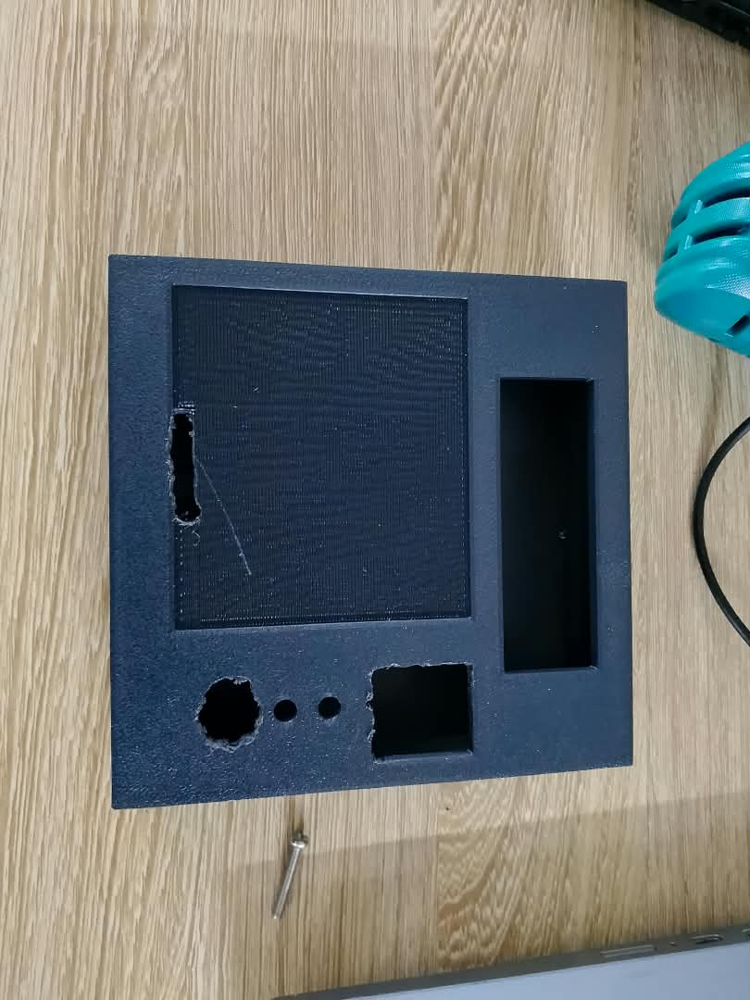

# Journal — Mardi 15 Septembre 2026 (rédigé par Lucas KPEGAN)
---

## Fait aujourd'hui

En cette journée intense d'intégration et de dépannage, notre équipe a dû faire face à un imprévu matériel majeur afin d'adapter et de poursuivre le développement du **Coffre-fort intelligent**.

* **Remplacement du Microcontrôleur & Migration de Pinout** :
* **Changement de carte** : Remplacement de l'ancien ESP32 endommagé (38 broches) par un nouveau modèle **ESP32-WROOM à 30 broches**.
* **Redéfinition du schéma de câblage** : Réexamen complet de la cartographie des broches (pinout), réattribution des GPIOs, des bus I2C et des liaisons série UART selon les contraintes du nouveau format à 30 pins.

* **Reconfiguration & Bancs d'essai individuels (Méthode itérative)** :
* **Module d'empreinte digitale (UART)** : Câblage et tests successifs (11 essais) jusqu'à la validation complète de la transmission de données, de la communication MicroPython et de la lecture biométrique.
* **Buzzer sonore** : Re-câblage et ajustement des signaux (16 essais) avec réécriture du code MicroPython de retours sonores (bips de validation, d'erreur et d'accès).
* **Clavier matriciel & LED** : Identification des lignes/colonnes et association aux nouvelles broches de l'ESP32 30 pins (6 essais), suivi de la commande d'état des LED.
* **Module Relais & Solénoïde** : Validation du fonctionnement individuel du solénoïde (16 essais). *Point d'attention* : l'activation conjointe du solénoïde via le relais reste en cours de diagnostic.
* **Écran LCD (I2C)** : Allumage et validation de l'alimentation dès le 2ᵉ essai ; prêt pour les tests de communication logicielle.

* **Fabrication numérique & Intégration mécanique** :
* **Usinage X-Tool** : Découpe de nouveaux panneaux de contreplaqué à la découpeuse laser X-Tool pour la réfection de la structure du coffre.
* **Impression 3D** : Impression et ajustement du boîtier de protection adapté aux dimensions du nouveau circuit et des composants.

* **Adaptation logicielle sous MicroPython** :
* Reprogrammation globale du script principal dans l'IDE Thonny pour mettre à jour l'attribution des broches GPIO et gérer les fonctions du buzzer, de l'empreinte, du clavier, du LCD et des LED.
---

## Appris

* **Impact du brochage (*Pinout*)** : Le passage d'un ESP32 à 38 broches à un modèle à 30 broches démontre qu'une modification matérielle impose une révision complète du schéma électrique et du code d'affectation des GPIOs.
* **Méthodologie d'intégration modulaire** : Tester séparément chaque composant (*Hardware-in-the-loop*) avant de tenter l'intégration globale permet d'isoler immédiatement la cause d'une panne (câblage, alimentation, code ou broche bloquante).
* **Synergie CAO / Fabrication Numérique** : L'adaptation de la structure physique (découpe laser X-Tool et impression 3D du boîtier) est indissociable de la taille et de l'organisation finale du circuit électronique.

---
## Raté, puis corrigé

**Erreur :** Lors de la première tentative d'intégration globale avec le nouvel ESP32 (30 pins), la communication biométrique, le buzzer, l'écran LCD et la commande du solénoïde via le relais ne répondaient plus simultanément.

**Hypothèse :** Erreurs d'affectation des broches dans le code MicroPython suite au changement de carte, couplées à des conflits de logique de commande et une chute de tension lors de la sollicitation simultanée du relais.

**Correction :**

1. Isolation de chaque périphérique et exécution de tests unitaires dédiés.
2. Mise à jour de la cartographie des broches dans le script MicroPython.
3. Reprogrammation spécifique des boucles de lecture pour le capteur d'empreinte et le buzzer.

**Résultat :** Validation individuelle réussie du capteur d'empreinte, du buzzer, du clavier, des LED et du LCD. L'intégration conjointe du relais/solénoïde demeure le dernier point à stabiliser.

---

## Décidé

* Ne raccorder un module au système global qu'après validation à 100 % de son test individuel.
* Vérifier et documenter le brochage (*pinout*) exact de toute nouvelle carte électronique avant de réaliser les connexions physiques.
* Ne modifier qu'un seul paramètre à la fois (matériel ou logiciel) lors des phases de diagnostic.

---

## À faire demain

* [ ] Résoudre le problème d'association et de commande du solénoïde via le module relais — *Julianna*
* [ ] Valider l'affichage dynamique des données et la communication I2C complète sur l'écran LCD — *Lucas*
* [ ] Stabiliser le fonctionnement simultané de l'ensemble des modules (empreinte, clavier, LCD, buzzer, relais) — *TEAM*
* [ ] Finaliser l'organisation propre des câbles et intégrer le circuit dans le boîtier imprimé 3D — *TEAM*
* [ ] Réaliser le test d'ouverture complet en conditions réelles dans la structure du coffre-fort — *TEAM*