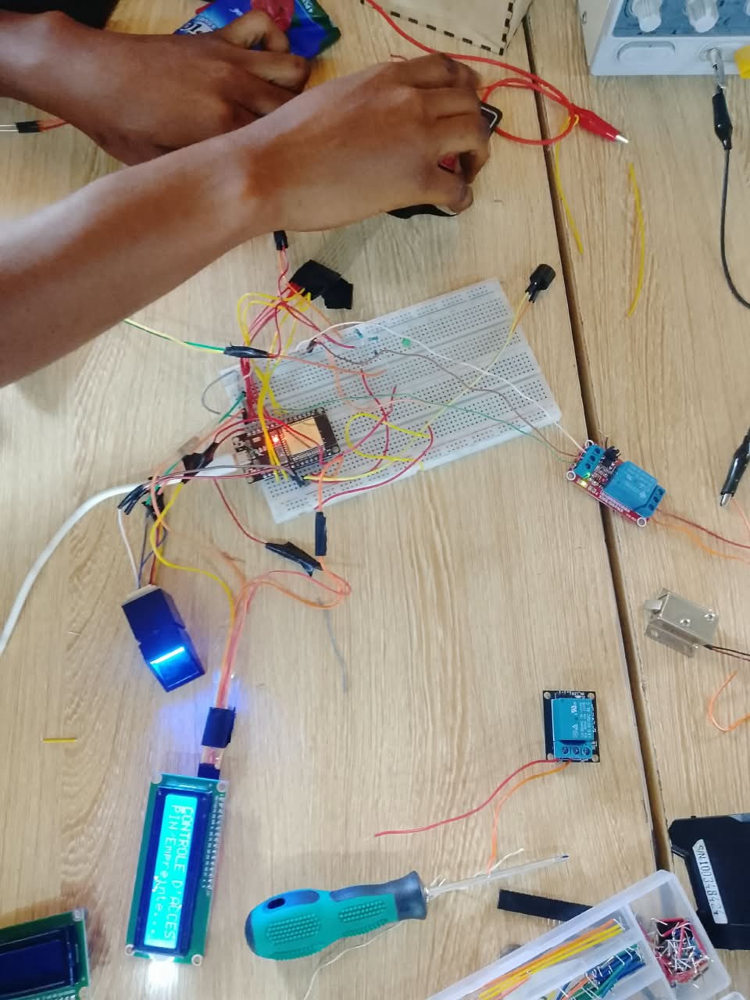
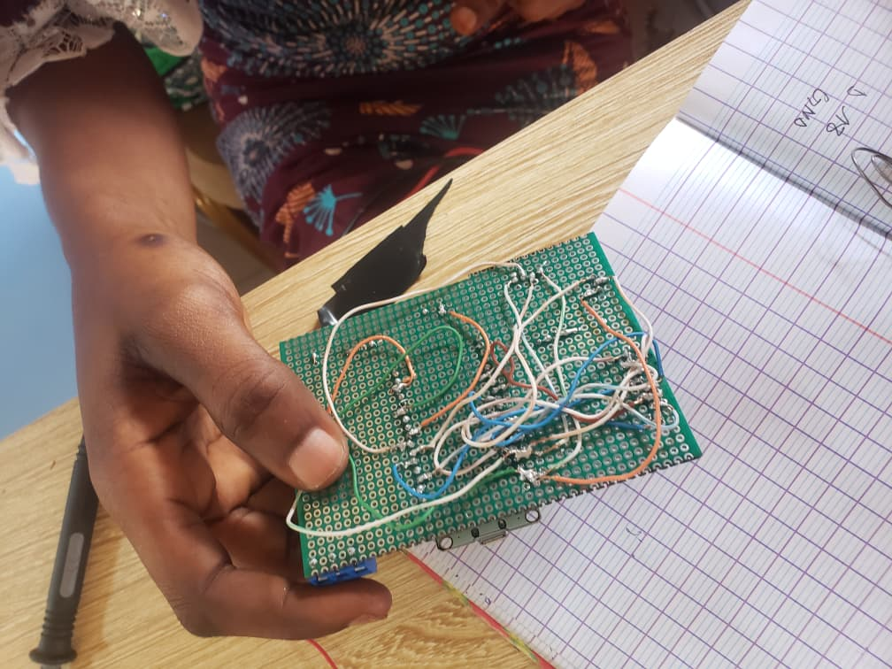

# Journal — Mercredi 16 Septembre 2026 (rédigé par Lucas KPEGAN)
---
## Fait aujourd'hui

En cette journée de débogage et d'assemblage, notre équipe a poursuivi l'optimisation du prototype du **Coffre-fort intelligent** en stabilisant à la fois la partie logicielle et la partie matérielle.

* **Révision & Débogage du code MicroPython** :
* Correction des erreurs et optimisation du script principal (`main.py`) avec l'appui d'outils d'assistance par IA (Gemini et Claude Code).
* Alignement de la logique logicielle avec le nouveau microcontrôleur.
.png)

* **Banc d'essai individuel & Résolution du problème de puissance** :
* Test méthodique de chaque composant du circuit.
* **Diagnostic du solénoïde** : Face au dysfonctionnement soudain du mécanisme de verrouillage (pourtant opérationnel auparavant), identification d'une défaillance au niveau du module relais.
* **Correction matérielle** : Remplacement du module relais par un nouveau modèle parfaitement compatible avec la charge du solénoïde.

* **Soudage & Prototypage sur plaquette perforée** :
* Soudage des connecteurs à vis (*Terminal Block*) sur la plaquette perforée (*perfboard*) pour sécuriser les liaisons d'alimentation et de puissance.

* **Assemblage mécanique** :
* Poursuite du montage et de la fixation des éléments physiques du coffre-fort.

---
## Appris
* **Rigueur des soudures en électronique** : L'importance d'une soudure propre et solide pour garantir la conductivité, éviter les faux contacts et assurer le bon fonctionnement global du circuit.
* **Analyse approfondie du code source** : La nécessité de relire et d'analyser attentivement les programmes informatiques autant de fois que nécessaire pour en maîtriser chaque aspect fonctionnel ; c'est une étape indispensable pour diagnostiquer et résoudre efficacement les bugs.

---

## Raté, puis corrigé

**Erreurs constatées :**

1. Échecs répétés lors de l'enregistrement de nouvelles empreintes digitales.
2. Confusion dans l'assignation des broches suite au changement de microcontrôleur.
3. Tentatives multiples et infructueuses pour actionner le solénoïde via le relais d'origine.

**Hypothèses :**

1. Incohérence dans la logique d'enregistrement du script MicroPython.
2. Perte de repères sur le nouveau brochage (*pinout*).
3. Incompatibilité ou défaillance interne du premier module relais sous la charge du solénoïde.

**Corrections :**

1. Correction des instructions d'enrôlement biométrique dans le code MicroPython.
2. Cartographie complète et consignation écrite de chaque broche et GPIO dans un cahier de suivi.
3. Remplacement du module relais défectueux par un modèle adapté.

**Résultat :** Enregistrement biométrique fonctionnel, repérage clair des connexions et déclenchement effectif du solénoïde par le nouveau relais.

---

## Décidé

* **Conserver les acquis matériel et logiciel** : figer le circuit et le code actuels qui fonctionnent parfaitement, sans tenter de modifications superflues afin d'éviter de déstabiliser le système validé.

---

## À faire demain

* [ ] Poursuivre l'assemblage du boîtier électronique — *Lucas*
* [ ] Équiper le circuit de sa source d'alimentation autonome : monter 3 piles rechargeables de $3{,}6\text{ V}$ en série (soit $10{,}8\text{ V}$) pour le solénoïde et 1 pile dédiée de $3{,}6\text{ V}$ pour l'ESP32 DEV KIT V1 — *Lucas*